Using PySimiam in Coursera 'Control of mobile robots' course
************************************************************

Welcome, Coursera students!

Last year, during the first installment of the "Control of Mobile Robots" class,
we have decided to build our own version of the robot simulator that doesn't need
MATLAB. This year we have the exciting opportunity to make our simulator available
to all of the students of the course, thanks to Dr. Magnus Egerstedt and the team.

Our simulator is inspired by the original `Sim.I.Am <http://gritslab.gatech.edu/home/2013/10/sim-i-am/>`_ simulator, and the programming assignments, as well as the robot description
were taken directly from the Sim.I.Am manual by Jean-Pierre de la Croix.
Special thanks to him for his hard work.

Introduction
============

This manual is going to be your resource for using the simulator in the programming exercises for this course. 

Installation
------------

The lastest release of pySimiam for Coursera students is available from `Sourceforge <http://sourceforge.net/projects/pysimiam/files/coursera/>`_ under the name pysimiam-coursera-weekX.zip (where X is the corresponding week for the exercise).

Unzip the latest provided archive and you are good to go!
Run the simulator with::
    
    >>> python qtsimiam_weekX.py

Requirements
^^^^^^^^^^^^

You will need a reasonably modern computer to run the robot simulator. While the simulator will run on hardware older than a Pentium 4, it will probably be a very slow experience. You will also need `Python 2.7 <http://www.python.org/getit/>`_ and two libraries - `Numpy <http://www.scipy.org/Download>`_ for mathematics and `PyQT <http://www.riverbankcomputing.com/software/pyqt/download>`_ for the GUI.

Bug Reporting
^^^^^^^^^^^^^

If you run into a bug (issue) with the simulator, please provide a detailed description either in a message in the discussion forums, in an issue in the sourceforge `issue tracker <http://sourceforge.net/p/pysimiam/tickets/>`_ or in an email to the developers. The bug will get fixed and a new version of the simulator will be available at sourceforge.

Mobile Robot
------------

The mobile robot you will be using in the programming exercises is the QuickBot. The QuickBot is equipped with 5 infrared (IR) range sensors. The QuickBot has a two-wheel differential drive system (two wheels, two motors) with a wheel encoder for each wheel. It is powered by two 4x AA battery packs on top and can be controlled via software on its embedded Linux computer, the BeagleBone Black. You can build the QuickBot yourself by following the hardware lectures in this course.

+-----------------------------------+-------------------------------+
| .. image:: quickbot_simulated.png | .. image:: quickbot-blue.png  |
|    :width: 400px                  |    :width: 400px              |
+-----------------------------------+-------------------------------+   
|   The simulated QuickBot          | The actual QuickBot           |
+-----------------------------------+-------------------------------+   
  
The robot simulator recreates the QuickBot as faithfully as possible. For example, the range, output, and field of view of the simulated IR range sensors match the specifications in the datasheet for the actual Sharp GP2D120XJ00F infrared proximity sensors on the QuickBot.

.. _coursera-irsensors:

IR Range Sensors
^^^^^^^^^^^^^^^^
You will have access to the array of five IR sensors that encompass the QuickBot. The orientation of IR sensors (relative to the body of the QuickBot, as shown in previous figure, is 90°, 45°, 0°, -45° and -90° degrees, respectively. IR range sensors are effective in the range 4 cm to 30 cm only. However, the IR sensors return raw values in the range of [0.4, 2.75]V instead of the measured distances. To complicate matters slightly, the BeagleBone Black digitizes the analog output voltage using a voltage divider and a 12-bit, 1.8V analog-to-digital converter (ADC). The following is a look-up table to demonstrate the relationship between the ADC output, the analog voltage from the IR proximity sensor, and the approximate distance that corresponds to this voltage.

.. csv-table:: 
   :header: "Distance (m)", "Voltage (V)", "ADC out"
   :widths: 12, 12, 12

    0.04 , 2.750 , 917
    0.05 , 2.350 , 783
    0.06 , 2.050 , 683
    0.07 , 1.750 , 583
    0.08 , 1.550 , 517
    0.09 , 1.400 , 467
    0.10 , 1.275 , 425
    0.12 , 1.075 , 358
    0.14 , 0.925 , 308
    0.16 , 0.805 , 268
    0.18 , 0.725 , 242
    0.20 , 0.650 , 217
    0.25 , 0.500 , 167
    0.30 , 0.400 , 133
    
Your supervisor can access the IR array through the ``robot_info`` object that is passed into the ``execute`` function. For example::

    for i, reading in enumerate(robot_info.ir_sensors.readings):
        print 'IR {} has a value of {}'.format(i, reading)

To use the sensor readings, you will have to convert them to actual distances. For that you need to convert from the ADC output to an analog output voltage, and then from the analog output voltage to a distance in meters. The conversion from ADC output to analog output voltage is simply,

.. math::
    :nowrap:

    \begin{equation*}
      V_{\text{ADC}} = \left\lfloor\frac{1000\cdot V_{\text{analog}}}{3}\right\rfloor
    \end{equation*}

Converting from the the analog output voltage to a distance is a little bit more complicated, because a) the relationships between analog output voltage and distance is not linear, and b) the look-up table provides a coarse sample of points.
You can use any way you like to convert between sensor readings and distances. For example, you can use the `SciPy <http://www.scipy.org/install.html>`_ mathematical library and interpolate the curve using `scipy.interpolate.inter1d <http://docs.scipy.org/doc/scipy/reference/generated/scipy.interpolate.interp1d.html#scipy-interpolate-interp1d>`_. Or you can fit the provided points with a high-degree polynomial and use this fit.

        
It is important to note that the IR proximity sensor on the actual QuickBot will be influenced by ambient lighting and other sources of interference. For example, under different ambient lighting conditions, the same analog output voltage may correspond to different distances of an object from the IR proximity sensor. The effect of ambient lighting (and other sources of noise) are *not* modelled in the simulator, but will be apparent on the actual hardware.

For the those curious to explain why IR sensors behave in an exponentially decaying manner: the intensity of the light decays in accordance to the `inverse square law`_. 

.. _inverse square law: http://en.wikipedia.org/wiki/Inverse-square_law

.. note:: In general, there is no need to know the exact indexing and number of the sensors, as all the information about the sensors is made available to the controllers and supervisors at runtime. In the best case, your code should be working even if the robot has 9 instead of 5 sensors.

.. _coursera-diffdrivedyn:

Differential Wheel Drive
^^^^^^^^^^^^^^^^^^^^^^^^

.. |vl| replace:: `v`\ :sub:`l`
.. |vr| replace:: `v`\ :sub:`r`

Since the QuickBot has a differential wheel drive (i.e., is not a unicyle), it has to be controlled by specifying the angular velocities of the right and left wheel (|vl|, |vr|), instead of the linear and angular velocities of a unicycle `(v, ω)`. These velocities are computed by a transformation from `(v, ω)` to (|vl|, |vr|). Recall that the dynamics of the unicycle are defined as,

.. math::
    \frac{dx}{dt} &= v\cos(\phi) \\
    \frac{dy}{dt} &= v\sin(\phi) \\
    \frac{d\phi}{dt} &= \omega

The dynamics of the differential drive are defined as,

.. math::
    \frac{dx}{dt} &= \frac{R}{2}(v_r + v_l)\cos(\phi) \\
    \frac{dy}{dt} &= \frac{R}{2}(v_r + v_l)\sin(\phi) \\
    \frac{d\phi}{dt} &= \frac{R}{L}(v_r - v_l)

where `R` is the radius of the wheels and `L` is the distance between the wheels.

The speed for the QuickBot can be obtained in the following way assuming that you have implemented the ``uni2diff`` function, which transforms `(v, ω)` to (|vl|, |vr|)::

    v = 0.15 # m/s
    w = pi/4 # rad/s
    # Transform from v,w to v_r,v_l
    vel_r, vel_l = self.uni2diff(v,w);
    
The angular wheel velocity for the QuickBot is limited to about 80 RPM. It is important to note that if the QuickBot is controlled ot move at maximum linear velocity, it is not possible to achieve any angular velocity, because the angular velocity of the wheel will have been maximized. Therefore, there exists a tradeoff between the linear and angular velocity of the QuickBot: *the faster the robot should turn, the slower it has to move forward*.

Wheel Encoders
^^^^^^^^^^^^^^
Each of the wheels is outfitted with a wheel encoder that increments or decrements a tick counter depending on whether the wheel is moving forward or backwards, respectively. Wheel encoders may be used to infer the relative pose of the robot. This inference is called *odometry*. The relevant information needed for odometry is the radius of the wheel, the distance between the wheels, and the number of ticks per revolution of the wheel. For example::

    R = robot_info.wheels.radius # radius of the wheel
    L = robot_info.wheels.base_length # distance between the wheels
    tpr = robot_info.wheels.ticks_per_rev # ticks per revolution for the wheels

    print 'The right wheel has a tick count of {}'.format(robot_info.wheels.right_ticks)
    print 'The left wheel has a tick count of {}'.format(robot_info.wheels.left_ticks)

Week 1. Getting to know pySimiam
================================

This week's exercises will help you learn about Python and the robot simulator:

1. Since the programming exercises involve programming in Python, you should familiarize yourself with this language. Point your browser to ``http://docs.python.org/2/tutorial/`` to get an introduction to basic concepts.
2. Familiarize yourself with the simulator by reading the section on :ref:`gui-tutorial`, this manual and running the simulator script ``qtsimiam_week1.py``.
  
  * Try different view modes, like focusing on the robot and zooming
  * Change the parameters of the supervisor. For example, change the position of the goal and watch the robot direct itself towards it (to see the position of the goal you have to turn on supervisor info drawing). Also try changing the PID gains.
  * Crash you robot against a wall! The collision detection was not implemented in the supervisor, so the robot does not react to any obstacles and collides with them.
  
3. You are welcome to read the :ref:`API documentation <user-api>` of the simulator parts and look at the simulator's code. The full understanding of the inner working is, however, not required to complete any of the assignments.

Grading
-------

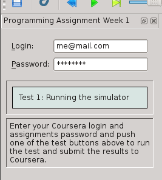

This week you only need to be able to run the simulator to get full grades. To submit your results for grading, enter your login and password from the `Assignments page <https://class.coursera.org/conrob-002/assignment/list>`_ (these are not your Coursera login and password - those will not work) into the corresponding fields of the grading window (see screenshot), and press the "Test 1: Running the simulator button". The tester will load the *week1* world and wait for the robot to reach the goal (or collide with something). Any submission errors will be displayed in the corresponding field.

If you have closed the submission window, you can call it back by pressing the 'coursera' button in the menu or on the toolbar.

Week 2. Understanding the robot
===============================

In this week's exercises you will teach the supervisor to process the information from the robot.

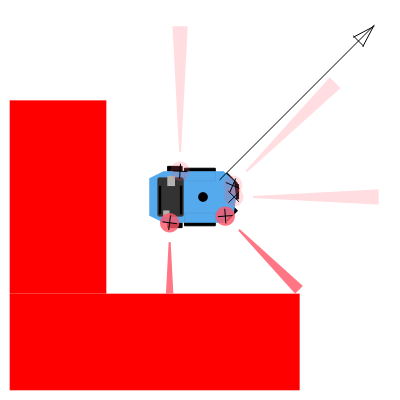

The simulator for this week can be run with::
    
    >>> python qtsimiam_week2.py

Alongside with the robot, some of the information provided by the supervisor is shown. The black dot in the middle of the robot is the current position of the robot, according to the supervisor. The arrow points in the direction of the goal angle (you can set it in supervisor properties). The crosses show the supervisor interpretation of the IR sensor signals. As your robot starts to move, you will also see two trajectories - one being the real trajectory of the robot, and the other calculated by the supervisor.

As you start the simulation for the first time, your robot will not move. To make it move, you will need to implement three components of the QuickBot supervisor, located in ``supervisors/week2.py``. Remember, that it is not necessary to restart the simulator program every time you make change the code. It should suffice to restart the simulation, by pushing the blue double arrow button.

Transformation from unicycle to differential drive dynamics
--------------------------------------------------------------------

The function used by the supervisor to convert from unicycle dynamics `(v, ω)` to differential drive dynamics (left and right *angular* wheel speeds (|vl|, |vr|)) is named ``uni2diff``::

    def uni2diff(self, uni):
        (v,w) = uni

        #Insert Week 2 Assignment Code Here

        # R = self.robot.wheels.radius
        # L = self.robot.wheels.base_length

        vl = 0
        vr = 0

        #End Week 2 Assignment Code

        return (vl, vr)

This function get as its input ``uni``, a python tuple with two values. The function has to return left and right wheel speeds also as a tuple.

You are given the values:

- ``w`` (float) - angular velocity *ω*
- ``v`` (float) - linear velocity `v`
- ``self.robot.wheels.radius`` (float) - `R`, the radius of robot's wheels
- ``self.robot.wheels.base_length`` (float) - `L`, the distance between wheels

You have to set the values:

- ``vl`` (float) - angular velocity of the left wheel |vl|
- ``vr`` (float) - angular velocity of the right wheel |vr|

Your job is to assign values to ``vl`` and ``vr`` such that the velocity and omega unicycle input correspond to the robot's left and right wheel velocities. Please refer to section on :ref:`coursera-diffdrivedyn` for the mathematical formulae.

Testing
^^^^^^^

With the ``uni2diff`` implemented, your robot will start to move as soon as you start the simulation, and as long as you don't change the goal angle, it will move in a circle. If the goal angle is negative, the robot will move clockwise, if positive, counterclockwise, Note, that the supervisor perceives the robot as stanionary (the black dot doesn't move with the robot). To change this, you need to implement odometry.

Odometry
--------
 
Implement odometry for the robot, such that as the robot moves around, its pose `(x, y, θ)` is estimated based on how far each of the wheels have turned. Assume that the robot starts at (0,0,0).
 
The video lectures and, for example the `OrcBoard tutorial <www.orcboard.org/wiki/images/1/1c/OdometryTutorial.pdf>`_, cover how odometry is computed. The general idea behind odometry is to use wheel encoders to measure the distance the wheels have turned over a small period of time, and use this information to approximate the change in pose of the robot.

.. note:: the video lecture may refer to robot's orientation as `ϕ`.

The pose of the robot is composed of its position `(x, y)` and its orientation θ on a 2 dimensional plane. The currently estimated pose is stored in the variable ``self.pose_est``, which bundles ``x``, ``y``, and ``theta`` (θ). The supervisor updates the estimate of its pose by calling the ``estimate_pose`` function. This function is called every ``dt`` seconds, where ``dt`` is 0.02s::

    def estimate_pose(self):
      
        #Insert Week 2 Assignment Code Here

        # Get tick updates
        #self.robot.wheels.left_ticks
        #self.robot.wheels.right_ticks
        
        # Save the wheel encoder ticks for the next estimate
        
        #Get the present pose estimate
        x, y, theta = self.pose_est          
                
        #Use your math to update these variables... 
        theta_new = 0 
        x_new = 0
        y_new = 0
        
        #End Week 2 Assignment Code
            
        return Pose(x_new, y_new, (theta_new + pi)%(2*pi)-pi)

You are given these variables:

- ``self.robot.wheels.radius`` (float) - the radius of robot's wheels
- ``self.robot.wheels.base_length`` (float) - the distance between wheels
- ``self.robot.wheels.ticks_per_rev`` (integer) - number of ticks registered per one full wheel revolution
- ``self.robot.wheels.left_ticks`` (integer) - accumulated ticks on the left wheel
- ``self.robot.wheels.right_ticks`` (integer) - accumulated ticks on the right wheel

Note that ``self.robot.wheels.left_ticks`` and ``.right_ticks`` represent
the tick numbering of the encoder and not the elapsed ticks. You will need
to implement a memory variable to store previous values and to calculate
the elapsed ticks. One example of how to do this might be::

   self.prev_right_ticks = self.robot.wheels.right_ticks
   self.prev_left_ticks = self.robot.wheels.left_ticks

Note that ``self.prev_left_ticks`` and ``self.prev_right_ticks`` have to be initialized
in the constructor. The code is already in place for you in the ``__init__()`` method.

Your objective is to solve for the change in `x`, `y`, and `θ`
and from those values update the variables `x_new`, `y_new`, and `theta_new`.
The values `x_new`, `y_new`, and `theta_new` will be used to update
the estimated pose for the supervisor. 

Testing
^^^^^^^

Congratulations! If you have implemented the odometry correctly, the robot moves around and aligns itself to the direction specified as goal angle. If it doesn't, there are several ways  to debug your code. First, it is always possible to insert ``print`` statements anywhere in your program to put some output into the console. Inside the supervisor class, you can also use the ``self.log`` function to output information into the simulator log. Second, you can use the `Python debugger <http://docs.python.org/2/library/pdb.html#module-pdb>`_. Note that the supervisor is running in a separate thread. Third, you can debug your supervisor graphically, by changing its ``draw`` function.

Convertion from raw IR values to distances in meters
----------------------------------------------------

The IR sensors return not the distance in meters, but a `reading`. To retrieve the distances measured by the IR proximity sensor, you will need to implement a conversion from the raw IR values to distances in the ``get_ir_distances`` function::

    def get_ir_distances(self):
        """Converts the IR distance readings into a distance in meters"""
        
        #Insert Week 2 Assignment Code Here

        ir_distances = [0]*len(self.robot.ir_sensors.readings) #populate this list

        #End Assignment week2

        return ir_distances

You are provided with the variable:

- ``self.robot.ir_sensors.readings`` (list of float) - the readings from QuickBot's IR sensors

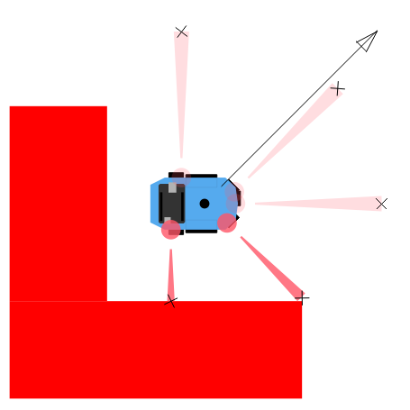

The section on :ref:`coursera-irsensors` contains a table with the values of readings for some sensor-object distances. You should interpolate these values and use you interpolation so that raw values in the range [200, 1375] are converted to distances in the range [0.04, 0.3] m. One simple way to do that is to use your favorite numeric analysis program and to fit the the provided points with a high-degree polynomial. The Numpy library, that you have already installed, can also be used to do the fitting, see the `polynomial module <http://docs.scipy.org/doc/numpy/reference/routines.polynomials.polynomial.html>`_, especially the functions `polyfit` and `polyval`.

After the conversion is implemented, your robot should look like on the image on the left.
 
Testing
^^^^^^^

To test the IR sensor readings, we recommend to open another world file, ``week2ir.xml``, from the simulator window. This world has five robots in it, all of which are close to different walls, and have different sets of IR sensors firing. You should see a black cross at the end of each sensor's cone if you have implemented the conversion for each sensor correctly. In the case the conversion doesn't work as expected, try printing the ``ir_distances`` array at the end of the ``get_ir_distances`` function and watch for errors.

Grading
-------

The three parts are graded separately. For the odometry, an error of 10% of the estimated pose is allowed, due to the low resolution of the encoders.

Week 3. Reaching the goal
=========================

The simulator for this week can be run with::
    
    >>> python qtsimiam_week3.py

You are encouraged (but not required) to reuse your code from week 2, by replacing the ``uni2diff``, ``estimate_pose`` and ``get_ir_distances`` implementations in ``pysimiam/supervisors/quickbot.py`` with your solutions. Do not copy the complete file, as some of the other methods are different, and will break the simulation. Also, if you want to reuse your solution to `get_ir_distances`, note that the ADC conversion factor (and all ADC voltages from the table) has changed to 1000/3, as an earlier mistake was corrected.

This week, when you start the application, you will also get an additional window with a plot. When your simulation is running, the plot is automaticlaly updated, showing the time dependence of the robot heading direction and the angle from robot to goal. If you wish to see the time dependence of any other parameter, you can change the code of ``qtsimiam_week3.py``. For example, currently the plotting code is::
    
    simWidget.add_graph([
            [("Robot theta", "robot.get_pose().theta", 'red'),
             ("Angle to goal","math.atan2(supervisor.parameters.goal.y - robot.get_pose().y,supervisor.parameters.goal.x - robot.get_pose().x)", 'blue')]    
            ])
            
To add another plot, for example, the time dependence of robot's `x` and the goal `x` position, one can change that code like this::

    simWidget.add_graph([
            [("Robot theta", "robot.get_pose().theta", 'red'),
             ("Angle to goal","math.atan2(supervisor.parameters.goal.y - robot.get_pose().y,supervisor.parameters.goal.x - robot.get_pose().x)", 'blue')],
            [("Robot X", "robot.get_pose().x", 'red'),
             ("Goal X", "supervisor.parameters.goal.x",'blue')],
            ])

If you do not see any plot windows, this means that none of the plotting engines could be loaded. You need one of the following libraries installed on your computer:
    
    * `SciPy <http://www.scipy.org/install.html>`_ (this will enable the `PyQtGraph <http://www.pyqtgraph.org/>`_ library packaged with pySimiam)
    * `matplotlib <http://matplotlib.org/index.html>`_
    * `PyQwt <http://pyqwt.sourceforge.net/>`_
    
We recommend installing SciPy or matplotlib. matplotlib can draw somewhat nicer plots, but is also much slower.
    
Note that plots are not necessary for the assignments, as you can use the robot real and estimated trajectories to judge the quality of your PID controller.
            
Implementing the PID
--------------------

This week you will be implementing the different parts of a PID regulator that steers the robot successfully to some goal location. This is known as the go-to-goal behavior. The controller that has to implement this behaviour is located at ``controllers/week3.py``. The important methods to implement are ``restart``, ``get_heading_angle`` and ``execute`` ::

    def restart(self):
        #Week 3 Assignment Code:
        #Place any variables you would like to store here
        #You may use these variables for convenience
        self.E_k = 0 # Integrated error
        self.e_k_1 = 0 # Previous error calculation
        
        #End Week 3 Assigment

    def get_heading_angle(self, state):
        """Get the heading angle in the world frame of reference."""
        
        #Insert Week 3 Assignment Code Here
        # Here is an example of how to get goal position
        # and robot pose data. Feel free to name them differently.
        
        #x_g, y_g = state.goal.x, state.goal.y
        #x_r, y_r, theta = state.pose
        
        return 0
        #End Week 3 Assigment        

    def execute(self, state, dt):
        """Executes avoidance behavior based on state and dt.
        state --> the state of the robot and the goal
        dt --> elapsed time
        return --> unicycle model list [velocity, omega]"""
        
        self.heading_angle = self.get_heading_angle(state)
        
        #Insert Week 3 Assignment Code Here
        
        # error between the heading angle and robot's angle
        e_k = 0
        
        # error for the proportional term
        e_P = 0
        
        # error for the integral term. Hint: Approximate the integral using
        # the accumulated error, self.E_k, and the error for
        # this time step, e_k.
        e_I = 0
                    
        # error for the derivative term. Hint: Approximate the derivative
        # using the previous error, obj.e_k_1, and the
        # error for this time step, e_k.
        e_D = 0    
        
        w_ = self.kp*e_P+ self.ki*e_I + self.kd*e_D
        
        v_ = state.velocity.v
        
        # save errors
        self.e_k_1 = e_k
        self.E_k = e_I
        
        #End Week 3 Assignment
        
        return [v_, w_]

In the ``restart`` function, the controller variables are initialized with the default values. It is called once at the creation of the controller, and possibly several times during its lifetime, in case the supervisor switches between two controllers. The direction to the goal is calculated in the ``get_heading`` function, that returns a vector pointing at the goal in the robot's reference frame. This function is called in the ``execute`` function to steer the robot. The ``execute`` function is called every time the supervisor uses the go-to-goal behaviour. The following variables are available inside ``get_heading``and ``execute``:

- ``state.goal.x`` (float) - The X coordinate of the goal
- ``state.goal.y`` (float) - The Y coordinate of the goal
- ``state.pose`` (:class:`~pose.Pose`) - The position and orientation of the robot
- ``state.velocity.v`` (float) - The given target velocity of the robot.
- ``self.kp`` (float) - The proportional gain.
- ``self.ki`` (float) - The integral gain.
- ``self.kd`` (float) - The differential gain.

To extract the pose data, you can use a command like this::

   (x, y, theta) = state.pose

For those, who are curious where the ``state`` variable comes from: it is computed by ``Supervisor.get_controller_state()``, that is reimplemented in ``QuickBotSupervisor``. You can find additional information in the documentation for :ref:`controller-tutorial` and in :class:`~controller.Controller` and :class:`~supervisor.Supervisor` API.

First, calculate the the heading angle for the robot. Let `u` be the vector from the robot located at `(x,y)` to the goal located at `(x_g,y_g)` in the world reference frame, then `theta_g` is the angle `u` makes with the `x`-axis (positive `theta_g` is in the counterclockwise direction). Use the `x` and `y` components of `u` and the ``math.atan2`` function to compute `theta_g`. `theta_g` has to be returned from the ``get_heading_angle`` method, to be used in ``execute``.

Second, calculate the error between the obtained and the current heading angle of the robot in `execute`. Make sure to keep the error between [`-π`, `π`].
 
Third, calculate the proportional, integral, and derivative terms for the PID regulator that steers the robot to the goal.
 
As before, the robot will drive at a constant linear velocity `v`, but it is up to the PID regulator to steer the robot to the goal, i.e compute the correct angular velocity *ω*. The PID regulator needs three parts implemented:
 
    #. The first part is the proportional term ``e_P``. It is simply the current error ``e_k``. ``e_P`` is multiplied by the proportional gain ``self.kp`` when computing ``w``.

    #. The second part is the integral term ``e_I``. The integral needs to be approximated in discrete time using the total accumulated error ``self.E_k``, the current error ``e_k``, and the time step ``dt``. ``e_I`` is multiplied by the integral gain ``self.ki`` when computing ``w``, and is also saved as ``self.E_k`` for the next time step.

    #. The third part is the derivative term ``e_D``. The derivative needs to be approximated in discrete time using the current error ``e_k``, the previous error ``self.e_k_1``, and the the time step ``dt``. ``e_D`` is multiplied by the derivative gain ``self.kd`` when computing ``w``, and the current error ``e_k`` is saved as the previous error ``self.e_k_1`` for the next time step.

Now, you need to tune your PID gains to get a fast settle time (`θ` matches `θ`\ :sub:`goal` within 10% in three seconds or less) and there should be little overshoot (maximum `θ` should not increase beyond 10% of the reference value `θ`\ :sub:`goal`). What you don't want to see are the following two graphs when the robot tries to reach goal location ``(x_g,y_g)=(0,-1)``:

    
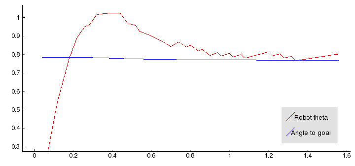
    
   Nearly 20% overshoot.

    
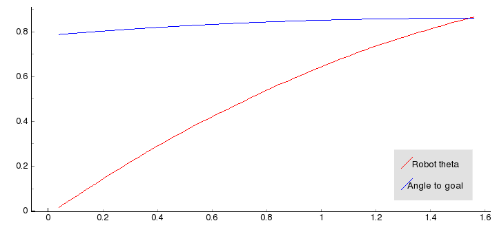
    
   Undershoot - very large setting time.

    

Testing
^^^^^^^

To test your code, the simulator is set up to use the PID regulator in ``controllers/week3.py`` to drive the robot to a goal location. You can change the linear velocity of the robot, the gains and the goal location using the dock window on the right.

Make sure the goal is located inside the walls, i.e. the `x` and `y` coordinates of the goal should be in the range [-1.5, 1.5]. Otherwise the robot will crash into a wall on its way to the goal!

#. To test the heading to the goal, check that the green arrow points to the goal. You can also use a ``print`` statement, set the goal location to (1,1) and check that ``theta_g`` is approximately :math:`\frac{\pi}{4} \approx 0.785` initially, and as the robot moves forward (since `v = 0.1` and `ω = 0`) ``theta_g`` should increase.

#. To test the error calculation and the PID math, run the simulator and check if the robot drives to the goal location. The trajectory of the robot can be shown using the `View > Show/hide robot trajectories` menu.

Ensuring the right *ω*
----------------------

.. |vld| replace:: `v`\ :sub:`l,d`
.. |vrd| replace:: `v`\ :sub:`r,d`
.. |vmax| replace:: `v`\ :sub:`max`
.. |wmax| replace:: *ω*\ :sub:`max`

This week we'll also tackle the first of two limitations of the motors on the QuickBot. The first limitation is that the robot's motors have a maximum angular velocity, and the second limitation is that the motors stall at low speeds. We will discuss the latter limitation in a later week and focus our attention on the first limitation. Suppose that we pick a linear velocity `v` that requires the motors to spin at 90% power. Then, we want to change *ω* from 0 to some value that requires 20% more power from the right motor, and 20% less power from the left motor. This is not an issue for the left motor, but the right motor cannot turn at a capacity greater than 100%. The results is that the robot cannot turn with the *ω* specified by our controller.
  
Since our PID controllers focus more on steering than on controlling the linear velocity, we want to prioritize *ω* over `v` in situations, where we cannot satisfy *ω* with the motors. In fact, we will simply reduce `v` until we have sufficient headroom to achieve *ω* with the robot. The function `ensure_w` in ``supervisors/week3.py`` is designed to ensure that *ω* is achieved even if the original combination of `v` and *ω* exceeds the maximum `vl` and `vr`.

The code that needs to be completed is in ``supervisors/week3.py``, in the method ``ensure_w``::
    
    def ensure_w(self,v_lr):
      
        v_l, v_r = v_lr
        
        #Week 3 Assignment Code:
               
        #End Week 3 Assigment
        
        return v_l, v_r    

``v_lr`` is a tuple containing left and right wheel velocities |vld| and |vrd|, as returned from ``uni2diff``.  A motor's maximum forward angular velocity is ``self.robot.wheels.max_velocity`` (|vmax|). You need to ensure that the two velocities |vl| and |vr| that are returned from ``ensure_w`` and sent to the robot do not exceed |vmax|. If *v* and/or *ω* are so large that |vld| and/or |vrd| exceed |vmax|, then `v` needs to be reduced to ensure *ω* is achieved. If *ω* is larger than the maximum available angular velocity |wmax|, you need to achieve at least |wmax|.

Remember, *ω* is determined by the difference between the two wheel velocities, while `v` is proportional to their sum. Try to keep the difference the same, but decrease or increase the sum, so that |vl| and |vr| are both between -|vmax| and |vmax|. Consider the following diagrams:

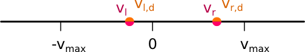
     
   Both |vld| and |vrd| are inside the range: no correction needed.

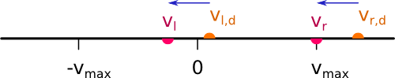
   
   |vrd| is outside of the range: both velocities should be shifted by |vrd| - |vmax|.

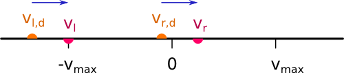
   
   |vld| is outside the range: both velocities should be shifted by -|vld| - |vmax|.

.. figure:: ensure_w_3.png
   :width: 400px
   :align: center
   
   Both |vld| and |vrd| are outside of the range: *ω* \> |wmax|.
   We have to set *ω* = |wmax| and *v* = 0.

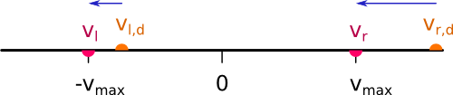
   
   Only |vrd| is outside of the range, but again *ω* \> |wmax|.
   We have to set *ω* = |wmax| and *v* = 0.

Note that the diagrams assume for simplicity that |vrd| > |vld|, that is *ω* > 0.
    
Testing
^^^^^^^

Set the robot velocity to 10. If the robot does not turn with this settings, then *ω* is not ensured by ``ensure_w``. Add ``print`` statements to check ``v_r - v_l`` (*ω*) and ``v_l + v_r`` (`v`) in the beginning and at the end of ``ensure_w``.

Grading
-------

The grader will test the following conditions this week:

    * **Arriving at the goal location**: Does the robot reach the goal location (within 5cm of the location)?
    * **Tuning the PID gains for performance**: Are the PID gains tuned such that the settle time is less than three second and the overshoot is no greater than 10% of the reference signal (angle to the goal location)?
    * **Reshaping the output for the hardware**: If the output of the controller (\ *v*\ ,\ *ω*\ ) is greater than what the motors support, is the linear velocity `v` scaled back to ensure *ω* is achieved?

Week 4. Avoiding obstacles
==========================

The simulator for this week can be run with::
    
    >>> python qtsimiam_week4.py

In the case you want to reuse your code from week 3, please note that the PID code is now located in ``controllers/pid_controller.py``. The ``execute`` method is using the heading from ``get_heading_angle`` to steer the robot. This heading is now in robot's coordinates, meaning that the robot is steered to have a heading angle of 0. You can replace the ``reset`` and ``execute`` methods with your code, but do not forget to change the steering to robot's coordinates.

The ``ensure_w`` method from last week is now located in ``supervisors/quickbot.py``. The logic has been slightly changed, as detailed below in the section :ref:`week4_ensure_w`.

AvoidObstacles controller
-------------------------

This week you will be implementing the different parts of a controller that steers the robot successfully away from obstacles to avoid a collision. This is known as the avoid-obstacles behavior. The IR sensors allow us to measure the distance to obstacles in the environment, but we need to compute the points in the world to which these distances correspond.

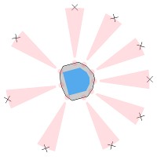

The figure illustrates these points with black crosses. The strategy for obstacle avoidance that we will use is as follows:

#. Transform the IR distances to points in the world.

#. Compute a vector to each point from the robot, :math:`u_0,u_1,\ldots,u_4`.

#. Weigh each vector according to their importance, :math:`\alpha_0u_0,\alpha_1u_1,\ldots,\alpha_4u_4`. For example, the front and side sensors are typically more important for obstacle avoidance while moving forward.

#. Sum the weighted vectors to form a single vector, :math:`u_o=\alpha_0u_0+\ldots+\alpha_4u_4`.

#. Use this vector to compute a heading and steer the robot to this angle.

This strategy will steer the robot in a direction with the most free space (i.e., it is a direction `away` from obstacles). For this strategy to work, you will need to implement two crucial parts of the strategy for the obstacle avoidance behavior in the function ``get_heading`` in ``pysimiam/controllers/week4.py`` using the following information:

- ``self.sensor_poses`` (list of :class:`~pose.Pose`) - The positions and orientations of IR sensors in the reference frame of the robot
- ``self.kp``, ``self.ki`` and ``self.kd`` - The PID gains of this controller
- ``state.sensor_distances`` (list of float) - The IR distances measured by each sensor
- ``state.pose`` (:class:`~pose.Pose`) - The position and orientation of the robot
- ``state.velocity.v`` (float) - The given target velocity of the simulation, which is usually the maximum available.

The following code is in place::

    def get_heading(self, state):

        # Week 4 Assignment:
        
        # Calculate vectors:
        self.vectors = []
        
        # Calculate weighted sum:
        heading = [1, 0, 1]
     
        # End Week 4 Assignment
     
        return heading

First, transform the IR distance (which you converted from the raw IR values in Week 2) measured by each sensor to a point in the reference frame of the robot.
  
A point :math:`p_i` that is measured to be :math:`d_i` meters away by sensor :math:`i` can be written as the vector (coordinate) :math:`v_i=\begin{bmatrix}d_i \\ 0\end{bmatrix}` in the reference frame of sensor :math:`i`. We first need to transform this point to be in the reference frame of the robot. To do this transformation, we need to use the pose (location and orientation) of the sensor in the reference frame of the robot: :math:`(x_{s_i},y_{s_i},\theta_{s_i})`. The transformation is defined as:

.. math::
    v'_i = R(x_{s_i},y_{s_i},\theta_{s_i})\begin{bmatrix}v_i \\ 1\end{bmatrix}

where :math:`R` is known as the transformation matrix that applies a translation by :math:`(x,y)` and a rotation by :math:`\theta`:

.. math::
    R(x,y,\theta) = \begin{bmatrix}
        \cos(\theta) & -\sin(\theta) & x \\ 
        \sin(\theta) &  \cos(\theta) & y \\
                   0 &             0 & 1
        \end{bmatrix}.

This matrix for a particular sensor can be obtained by calling the method ``get_transformation`` on the sensor's pose. To construct the coordinates of the point in the sensor reference frame, use the ``numpy.array`` constructor. ``numpy.dot(a,b)`` implements the dot product of two matrices. Store the result of the transformation as a list of :math:`v'_i` vectors (or as a 2D array) in the variable ``self.vectors``. The calculated vectors are now illustrated in the simulator by the black crosses. Note how these points `approximately` correspond to the distances measured by each sensor.

.. note:: The points do not exactly correspond to the distances because of how we converted from raw IR values to meters in Week 2).
  
Second, use the set of transformed points to compute a vector that points away from the obstacle. The robot will steer in the direction of this vector and successfully avoid the obstacle.
  
    #. Pick a weight :math:`\alpha_i` for each vector according to how important you think a particular sensor is for obstacle avoidance. For example, if you were to multiply the vector from the robot to point `i` (corresponding to sensor `i`) by a small value (e.g., 0.1), then sensor `i` will not impact obstacle avoidance significantly. Set the weights in the constructor or in ``set_parameters``.

        .. note:: Make sure to that the weights are symmetric with respect to the left and right sides of the robot. Without any obstacles around, the robot should only steer slightly right (due to a small asymmetry in the how the IR sensors are mounted on the robot).

    #. Sum up the weighted vectors, :math:`\alpha_iv'_i`, into a single vector :math:`u_o` (for example using matrix multiplication).

    #. Return this vector as a heading away from obstacles (i.e., in a direction with free space, because the vectors that correspond to directions with large IR distances will contribute the most to :math:`u_o`).

.. note:: Note that the heading vector should be define in robot's coordinate system, not in the global one.
   
Testing
^^^^^^^

To test your code, the simulator is set up to use load the ``week4.py`` controller to drive the robot around the environment without colliding with any of the walls.
Here are some tips on how to test the three parts:

#. Once you have implemented the calculation of obstacle vectors, a black cross should match up with each sensor as shown in figure above. The robot should drive forward and collide with the wall.

#. Once you have implemented the steering, the robot should be able to successfully navigate the world without colliding with the walls (obstacles). If no obstacles are in range of the sensors, the red arrow (representing :math:`u_o`) should just point forward (i.e., in the direction the robot is driving). In the presence of obstacles, the red line should point away from the obstacles in the direction of free space.

You can also tune the parameters of the PID regulator for `ω`.

.. note:: The red arrow (as well as the black crosses) will likely deviate from its position on the robot. The reason is that it are drawn with information derived from the odometry of the robot. The odometry of the robot accumulates error over time as the robot drives around the world. This odometric drift can be seen when information based on odometry is visualized via the lines and crosses. 

.. _week4_ensure_w:

QuickBot motor limitations
--------------------------

Last week we implemented a function, ``ensure_w``, which was responsible for respecting `ω` from the controller as best as possible by scaling `v` if necessary. This implementation assumed that it was possible to control the angular velocity in the range ``[-vel_max, vel_max]``. This range reflected the fact that the motors on the QuickBot have a maximum rotational speed. However, it is also true that the motors have a minimum speed before the robot starts moving. If not enough power is applied to the motors, the angular velocity of a wheel remains at 0. Once enough power is applied, the wheels spin at a speed ``vel_min``.

The ``ensure_w`` function has been updated this week to take this limitation into account. For example, small ``(v,ω)`` may not be achievable on the QuickBot, so ``ensure_w`` scales up `v` to make `ω` possible. Similarily, if ``(v,ω)`` are both large, ``ensure_w`` scales down `v` to ensure `ω` (as was the case last week). You can use the ``print`` statement to see ``(v,ω)`` before and after.

There is nothing that needs to be added or implemented for this week in ``ensure_w``, but you may find it interesting how one deals with physical limitations on a mobile robot, like the QuickBot. This particular approach has an interesting consequence, which is that if `v` > 0, then `v_r` and `v_l` are both positive (and vice versa, if `v` < 0). Therefore, we often have to increase or decrease `v` significantly to ensure `ω` even if it were better to make small adjustments to both `ω` and `v`. As with most of the components in these programming assignments, there are alternative designs with their own advantages and disadvantages. Feel free to share your designs with everyone on the discussion forums!

Grading
-------
 
The grader will test the following conditions this week:

    * **From IR distances to points in the World**: Are the IR distances interpreted as points in the sensor's coordinate frame correctly transformed to the world coordinate frame?
    * **Avoiding obstacles for 60 seconds**: Can the robot roam around the world without collisions for 60 seconds? The robot should travel at least 0.5 m away from the start point.

Week 5. Mixing behaviours
=========================

The simulator for this week can be run with::
    
    >>> python qtsimiam_week5.py

You are encouraged (but not required) to reuse your code from week 4, by replacing the `set_parameters` and `get_heading` method in ``controllers/avoidobstacles.py`` with your solutions. Note that the ``self.vectors`` variable is not needed anymore, so you can optimize your code further by getting rid of it, if you want.

This week you will be making a small improvement to the go-to-goal and avoid-obstacle controllers and testing two arbitration mechanisms: blending and hard switches. Arbitration between the two controllers will allow the robot to drive to a goal, while not colliding with any obstacles on the way.

Linear velocity dependent on angular velocity
---------------------------------------------

So far, we have implemented controllers that either steer the robot towards a goal location, or steer the robot away from an obstacle. In both cases, we have set the linear velocity, `v`, to a constant value defined by the user. While this approach works, it certainly leaves plenty of room for improvement. We will improve the performance of both the go-to-goal and avoid-obstacles behavior by dynamically adjusting the linear velocity based on the angular velocity of the robot.

We previously learned that with a differential drive robot, we cannot, for example, drive the robot at the maximum linear and angular velocities. Each motor has a maximum and minimum angular velocity; therefore, there must be a trade-off between linear and angular velocities: linear velocity has to decrease in some cases for angular velocity to increase, and vice versa.
  
We added the ``ensure_w`` function over the last two weeks, which ensured that *ω* is achieved by scaling *v*. However, for example, one could improve the above strategy by letting the linear velocity be a function of the angular velocity *and* the distance to the goal (or distance to the nearest obstacle).
  
Improve your go-to-goal and avoid-obstacles controllers by adding a simple function that adjusts *v* as function of *ω* and other information. For example, the linear velocity in the go-to-goal controller could be scaled by *ω* and the distance to the goal, such that the robot slows down as it reaches the goal. 

The right place to implement such adjustments is the :meth:``~controller.Controller.execute`` function of both the GoToGoal controller in ``controllers/gotogoal.py`` and the AvoidObstacles controller in ``controllers/avoidobstacles.py``::

    def execute(self, state, dt):
        
        v, w = PIDController.execute(self, state, dt)
        
        # Week 5 code
        #
        # 
        
        return v, w  

.. note:: This part of the programming assignment is open ended and not checked by the automatic grader, but it will help with the other parts of this assignment.

Blending behaviours
---------------------

It's time to implement the first type of arbitration mechanism between multiple controllers: `blending`. The solutions to the go-to-goal and avoid-obstacles controllers have been combined into a single controller ``controller/week5.py``. However, one important piece (namely the implementation of ``get_heading``) is missing::

    def get_heading(self, state):
        """Blend the two heading vectors"""

        # Get the outputs of the two subcontrollers
        u_ao = AvoidObstacles.get_heading(self,state)
        self.away_angle = math.atan2(u_ao[1],u_ao[0])
        u_ao = numpy.array([math.cos(self.away_angle),math.sin(self.away_angle),1])        
        
        self.goal_angle = GoToGoal.get_heading_angle(self,state)
        u_gtg = numpy.array([math.cos(self.goal_angle),math.sin(self.goal_angle),1])        
        
        # Week 5 Assigment Code goes here:
        
        u = u_gtg
        
        # End Week 5 Assigment
                
        return u

Here, ``u_gtg`` is a vector pointing to the goal from the robot, and ``u_ao`` is a vector pointing from the robot to a point in space away from obstacles. These two vectors need to be combined (blended) in some way into the vector ``u``, which should be a vector that points the robot both away from obstacles and towards the goal. Both vectors are NumPy arrays and support arbitrary array operations. The vectors are normalized to have a length of 1.

The combination of the two vectors into ``u`` should result in the robot driving to a goal without colliding with any obstacles in the way. Do not use ``if/else`` to pick between ``u_gtg`` or ``u_ao``, but rather think about weighing each vector according to their importance, and then linearly combining the two vectors into a single vector, ``u_ao_gtg``. For example,

.. math::
    \alpha &=& 0.75 \\
    u &=& \alpha u_{\mathrm{gtg}}+(1-\alpha)u_{\mathrm{ao}}

In this example, the go-to-goal behavior is stronger than the avoid-obstacle behavior, but that `may` not be the best strategy. `α` needs to be carefully tuned (or a different weighted linear combination needs to be designed) to get the best balance between go-to-goal and avoid-obstacles. You may also want to adjust *v* for this controller, as you did for the other two in the previous part of the assignment.  

Testing
^^^^^^^^^^

To run the simulator with the blending supervisor use::

    >>> python qtsimiam_week5.py blending

You will see three arrows showing the information about different headings:

.. image week-5-blending.png::
    :width: 300px

The green arrow is the heading returned by the GoToGoal controller, the red arrow - the heading returned by the AvoidObstacles controller. The blue arrow is the blended vector.

The robot should successfully navigate to the goal location (1,1) without colliding with the obstacle that is in the way. When the robot is near the goal, it will start circling around it. Don't worry, this behaviour will be taken care of in the next part.

Switching between behaviours
------------------------------

The second type of arbitration mechanism is `switching`. Instead of executing both go-to-goal and avoid-obstacles simultaneously, we will only execute one controller at a time, but switch between the two controllers whenever a certain condition is satisfied.
    
You will need to implement the switching logic between go-to-goal and avoid-obstacles in ``supervisors/week5_switching.py``. The supervisor has a built-in state machine to support switching between different controllers (or states, where a state simply corresponds to one of the controllers being executed). In order to switch between different controllers (or states), the supervisor has to define the switching conditions. These conditions are checked to see if they are true or false. The idea is to start of in some state (which runs a certain controller), check if a particular condition is fullfilled, and if so, switch to a new controller.

The controllers and the switching conditions are initialized in the ``__init__`` method of the supervisor. The following code is in place::

    def __init__(self, robot_pose, robot_info):
        """Create necessary controllers"""
        QuickBotSupervisor.__init__(self, robot_pose, robot_info)

        # Fill in poses for the controller
        self.parameters.sensor_poses = robot_info.ir_sensors.poses[:]

        # Create the controllers
        self.avoidobstacles = self.create_controller('AvoidObstacles', self.parameters)
        self.gtg = self.create_controller('GoToGoal', self.parameters)
        self.hold = self.create_controller('Hold', None)

        # Create some state transitions
        self.add_controller(self.hold)
        self.add_controller(self.gtg, \
                            (self.at_goal, self.hold), \
                            (self.at_obstacle, self.avoidobstacles))
        
        # Week 5 Assigment code should go here
        
        # End Week 5 Assignment
        
        # Start in 'go-to-goal' state
        self.current = self.gtg

This code creates three controllers - `GoToGoal`, `AvoidObstacles` and `Hold`. You are already familiar with the first two. The third controller just makes the robot stop (it returns (0,0) as linear and angular velocities). This code also defines a switching condition between `GoToGoal` and `Hold` and between `GoToGoal` and `AvoidObstacles`, and makes `GoToGoal` the starting state. The ``add_controller`` method of the supervisor should be called in the following way::
    
    self.add_controller(controller0, (condition1, controller1), (condition2, controller2), ...)

to add a state with a controller ``controller0``. The conditions are functions that take no parameters and evaluate to true or false. If a condition evaluates to true, the controller is switched e.g. to ``controller1`` for ``condition1``.

The code in the supervisor now corresponds to the following diagram:

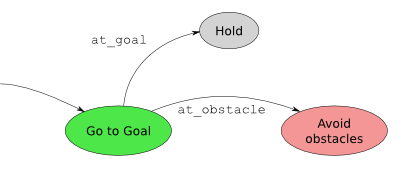

But this way the robot might never reach the goal! Your task is to update the logic to complete the diagram:

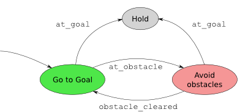

You should also implement the condition functions. We suggest defining at least the following conditions:

* ``at_obstacle`` checks to see if any of front sensors (all but the three IR sensors in the back of the robot) detect an obstacle at a distance less than a certain limiting distance. Return ``true`` if this is the case, ``false`` otherwise.
* ``at_goal`` checks to see if the robot is within some small distance of the goal location (e.g. ``self.robot.wheels.base_length/2``).
* ``obstacle_cleared`` checks to see if all of the front sensors report distances greater than some fixed distance. Remember, that this distance has to be larger than the distance used by ``at_obstacle``, to avoid Zeno behaviour.

When implementing various conditions, take note that the functions are called without any arguments. So, all of the parameters you want to access should be stored in the supervisor. You can precalculate anything you need in the ``process_state_info`` function that is guaranteed to be called before any conditions are checked. You may also find the following variables useful:

- ``self.parameters.goal.x`` (float) - The X coordinate of the goal
- ``self.parameters.goal.y`` (float) - The Y coordinate of the goal
- ``self.parameters.pose`` (:class:`~pose.Pose`) - The position and orientation of the robot
- ``self.parameters.velocity.v`` (float) - The given target velocity of the robot
- ``self.parameters.sensor_distances`` (list of float) - The IR distances measured by each sensor
- ``self.robot.ir_sensors.rmax`` (float) - The maximum distance that can be detected by an IR sensor
- ``self.robot.ir_sensors.poses`` (list of :class:`~pose.Pose`) - The positions and orientations of IR sensors in the reference frame of the robot

Testing
^^^^^^^^^

You can test the the switching supervisor by running::

    >>> python qtsimiam_week5.py switching

.. note:: You don't have to restart the simulator to try another supervisor - instead you can load another world (e.g. ``week5_switching.xml``) directly with `File > Open`.

You will see two arrows showing the GoToGoal and AvoidObstacles headings, with the current heading showing as a thicker arrow:

.. image week-5-switching.png::
    :width: 300px

The robot should successfully navigate to the same goal location (1,1) without colliding with the obstacle that is in the way. This time once the robot is near the goal, it should stop. In the log window you should see a lot of messages indicating that the controllers have been switched. You should see that the robot switches frequently between the two during its journey.

Mix blending and switching
----------------------------

The blending controller's advantage is that it (hopefully) smoothly blends go-to-goal and avoid-obstacles together. However, when there are no obstacle around, it is better to purely use go-to-goal, and when the robot gets dangerously close, it is better to only use avoid-obstacles. The switching logic performs better in those kinds of situations, but jitters between go-to-goal and avoid-obstacle when close to a goal. A solution is to squeeze the blending controller in between the go-to-goal and avoid-obstacle controller.

To create the blending controller add the following code to the constructor in ``supervisors/week5_switching.py``::

    self.blending = self.create_controller('week5.Blending', self.parameters)

and the following code to the ``set_parameters`` method::

    self.blending.set_parameters(self.parameters)

Implement additional conditions:

* ``unsafe``, that checks to see if any of the front sensors detect an obstacle closer than a critical distance (this distance should be smaller than ``at_obstacle`` critical distance).
* ``safe``, that checks if the the minimal distance is larger than the critical distance.

Those conditions can now be used to implement switching like shown on the diagram:

.. image:: blending_states.png

Testing
^^^^^^^^^

You can test the switching supervisor as before. This time, the controller should switch much less often than before. Now you can also see the switches to the blended controller (blue arrow). Depending on how you set the critical distances, the number of switches and between which controllers the supervisor switches may change. Experiment with different settings to observe their effect.

Comparing the supervisor performance
^^^^^^^^^^^^^^^^^^^^^^^^^^^^^^^^^^^^^^

You can make the blending and the switching supervisors race against one another::

    >>> python qtsimiam_week5.py race

.. note:: You don't have to restart the simulator to try another supervisor - instead you can load another world (e.g. ``week5_race.xml``) directly with `File > Open`.

Joystick and switching (optional)
----------------------------------

Following Sim.I.Am, pySimiam now also has the capability to control the robot (a real or a simulated one) with a joystick. If you have a joystick, you can try it out by loading the ``joystick.xml`` world. Note, that you will need the `pygame library <http://pygame.org/download.shtml>`_ for this functionality. Also, you might want to configure your joystick in the supervisor parameter window.

Although controlling a robot with a joystick is fun, we can do better, since our robot is intelligent. One possible improvement will be to make the supervisor switch between the `Joystick` and the `AvoidObstacles` behaviour if the robot comes too close to an obstacle. The switching can be implemented in the same way as before, only replacing the `GoToGoal` controller with the `Joystick` controller. The supervisor code is located at ``supervisors/joystick.py``.

.. note:: Since pySimiam supports an arbitrary number of robots, you can use more than one joystick and control more than one robot. You will have to edit ``worlds/joystick.xml`` to add more robots to the world.

.. note:: The implementation of shooting robots is left to the reader as an advanced excercise.

Grading
-------
 
The grader will test the following conditions this week:

    * **Collision-free navigation with blending**: Does the robot reach the goal in less than 60 seconds without crashing?
    * **Collision-free navigation with switching**: Does the robot reach the goal in less than 60 seconds without crashing and without switching between controllers more often than two times per second on average?

Week 6. Following walls
=======================

The simulator for this week can be run with::
   
   >>> python qtsimiam_week6.py

If you wish, you can reuse your PID code in ``controllers/pid_controller.py`` and pose estimation code in ``supervisors/quickbot.py``.

This week you will be implementing a wall following behavior that will aid the robot in navigating around obstacles. Implement these parts in the ``get_heading`` method of ``controllers/week6.py``::

   def get_heading(self, state):
      """Get the direction away from the obstacles as a vector."""
      
      # Week 6 Assignment:
      
      # Calculate vectors for the sensors
      self.vectors = []

      # Calculate the vector along the wall
      self.along_wall_vector = [0.3,0,1]

      # Calculate the vector to the closest wall point:
      self.to_wall_vector = [0,0.3,1]
                           
      # Calculate and return the heading vector:                            
      return self.along_wall_vector
   
      # End Week 6 Assignment

Estimate wall geometry
----------------------

We will use the IR sensors to detect an obstacle and construct a vector that approximates a section of the obstacle (`wall`). In the figure, this vector, :math:`u_{fw,t}`, is illustrated in magenta.

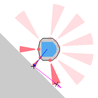

The direction of the wall following behavior (whether the obstacle on the left or right is followed) is determined by ``self.direction``, which can either be equal to ``"right"`` or to ``"left"``. Suppose we want to follow an obstacle to the `left` of the robot, then we would use the left set of IR sensors (0, 1 and 2). If we are following the wall, then at all times there should be at least one sensor that can detect the obstacle. So, we need to pick a second sensor and use the points corresponding to the measurements from these two sensors (see avoid-obstacles in Week 4) to form a line that estimates a section of the obstacle. In the figure on the left, sensors 3 and 4 are used to roughly approximate the edge of the obstacle.

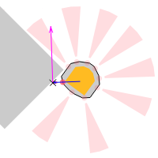

The situation is trickier when the robot reaches a corned (see the figure on the right), because typically only a single sensor will be able to detect the wall. The estimate is off as one can see in the figure, but as long as the robot isn't following the wall too closely, it will be ok.

You should first fill in the ``self.vectors`` variable, as you did in week 4, to obtain the set of vectors pointing to the wall. An example strategy for estimating a section of the wall is to pick the two sensors (from IR sensors 0-2) with the smallest reported measurement in ``state.sensor_distances``. Suppose sensor 0 and 1 returned the smallest values, then let :math:`p_1` ``= self.vectors[0]`` and :math:`p_2` ``= self.vectors[1]``. A vector that estimates a section of the obstacle is :math:`u_{fw,t}=p_2-p_1`. 

.. note:: It is important that the sensor with larger abs(θ) (in the example, sensor 0) is assigned to :math:`p_1` and the sensor with the smaller abs(θ) (in the example, sensor 1) is assigned to :math:`p_2`, because we want that the vector points in the direction that robot should travel.

.. note:: In the code, :math:`u_{fw,t}` is represented by ``self.along_wall_vector``.

The figures correspond to the above example strategy, but you may want to experiment with different strategies for computing :math:`u_{fw,t}`. A better estimate would make wall following safer and smoother when the robot navigates around the corners of obstacles. 

Find the closest wall point
---------------------------
   
Now that we have the vector :math:`u_{fw,t}` (represented by the magenta arrow in the figures), we need to compute a vector :math:`u_{fw,p}` that points from the robot to the closest point on :math:`u_{fw,t}`. This vector is visualized as blue arrow in the figures and can be computed using a little bit of linear algebra:

.. math::
   \begin{split}
      u'_{fw,t} &= \frac{u_{fw,t}}{\|u_{fw,t}\|}, \quad u_p = \begin{bmatrix} x \\ y \end{bmatrix}, \quad u_a = p_1 \\
      u_{fw,p} &= (u_a-u_p)-((u_a-u_p)\cdot u'_{fw,t})u'_{fw,t}
   \end{split}

.. note:: A small technicality is that we are computing :math:`u_{fw,p}` as the the vector pointing from the robot to the closest point on :math:`u_{fw,t}`, as if :math:`u_{fw,t}` were infinitely long.

.. note:: In the code, :math:`u_{fw,p}` is represented by ``self.to_wall_vector``.

Compute the heading vector
--------------------------
   
The last step is to combine :math:`u_{fw,t}` and :math:`u_{fw,p}` such that the robot follows the obstacle all the way around at some distance :math:`d_{fw}` (``self.distance`` in the code). :math:`u_{fw,t}` will ensure that the robot drives in a direction that is parallel to an edge on the obstacle, while :math:`u_{fw,p}` needs to be used to maintain a distance :math:`d_{fw}` from the obstacle.

One way to achieve this is,

.. math::
   u'_{fw,p} = u_{fw,p}-d_{fw}\frac{u_{fw,p}}{\|u_{fw,p}|},

where :math:`u'_{fw,p}` is now a vector points towards the obstacle when the distance to the obstacle, :math:`d>d_{fw}`, is near zero when the robot is :math:`d_{fw}` away from the obstacle, and points away from the obstacle when :math:`d<d_{fw}`.

All that is left is to linearly combine :math:`u'_{fw,t}` and :math:`u'_{fw,p}` into a single vector :math:`u_{fw}` that can be used with the PID controller to steer the robot along the obstacle at the distance :math:`d_{fw}`. (`Hint`: Think about how this worked with :math:`u_{ao}` and :math:`u_{gtg}` last week). 

Testing
-------

Running ``qtsimiam_week6.py`` shows you a world with six robots and two obstacles. The robots are set up near the obstacle, so that they can start following it immediately. This is a valid situation, because we are assuming another behavior (like go-to-goal) has brought us near the obstacle.

First, test the construction of ``to_wall_vector`` and ``along_wall_vector``. Do not start the simulation yet. For each robot you should see the two vectors positioned correctly -  the magenta arrow approximately matches up with the edge of the obstacle, and the blue arrow should point from the robot to the closest point on the wall.

Second, test the follow wall behaviour by running the simulation. The robots should be able to follow the obstacle all the way around. Set `distance` to some distance in [0.04, 0.3] m. The robot should follow the wall at approximately the specified distance. If the robot does not follow the wall at the specified distance, then :math:`u'_{fw,p}` is not given enough weight (or :math:`u'_{fw,t}` is given too much weight).  

.. note:: Depending on how the edges of the obstacle are approximated, it is possible for the robot to peel off at one of the corners. This is not the case in the example strategy provided for the first part.

.. note:: If the amount of robots seems overwhelming, you can comment out some of them in the ``worlds/week6.xml``. If the simulation is too slow, turn off drawing of robot trajectories.

Grading
-------

The grader will test your controller in different worlds (``worlds/week6_test_left.xml`` and ``worlds/week6_test_right.xml``). You can load these worlds into the simulator and try them out. They contain a single robot, that should be able to go around the obstacle two times without crashing in less than 90 seconds.

.. note:: The grader will test the robot using the default gains provided by the supervisor. If you want to use different gains, change the values in ``init_default_parameters`` in ``supervisors/week6.py``

Controlling the real QuickBot
=============================

If you have built a QuickBot, you can use pySimiam and the controllers/supervisors you implemented to make it autonomous.

Establishing the connection
---------------------------

First, you have to make sure that pySimiam and the robot can communicate with each other. Start by following the `instructions <https://class.coursera.org/conrob-002/wiki/Hardware>`_ provided by Rowland O'Flaherty to find out the IP addresses of you host computer and the robot, and to start the program on the robot. After this is done, edit the ``worlds/qb_realtime_pc.xml`` world file::

    <?xml version="1.0" ?>
    <simulation>
        <robot type="qb_realtime.QuickBot" options='{"baseIP":"192.168.0.1", "robotIP":"192.168.0.6", "port":5005}'>
            <pose theta="0.0" x="0.0" y="0.0"/>
            <supervisor type="qb_realtime_pwmtest.PWMTest"/>
        </robot>
    </simulation>

You have to set *baseIP* to your host IP address, *robotIP* to your robot IP address, and *port* to the port you chose earlier. Now, you can run the control code::
    
    >>> python qtsimiam_realtime.py

If there is no error message after a couple of seconds, the connection with the QuickBot has been established successfully.

Calibrating the motors
----------------------
    
The second step is the calibration of the motors. The angular velocity of the wheels is defined by the `pulse-width-modulated signal <http://en.wikipedia.org/wiki/Pulse-width_modulation>`_ (PWM) that the BeagleBone board is sending to the motors. This dependence is not known apriori, as it depends on the motors, the wheels and the surface. To be able to control your robot reliably, you have to measure this dependence and put into code.

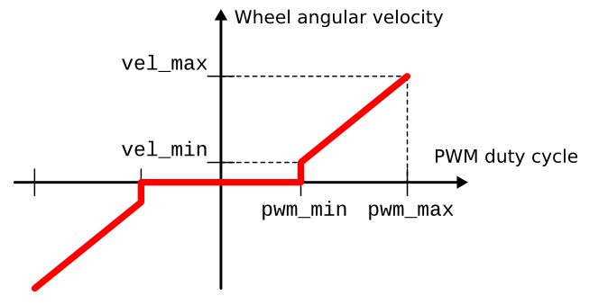

To simplify the task, we are going to assume a dependence in the form shown on the graph: there is a minimal PWM number required to make the wheels turn, and after this point the angular velocity increases linearly with the power provided.

When you start the program, the supervisor that you get allows you to control the PWM for left and right wheel separately. Begin by determining the lowest PWM setting for the robot to start moving. Try several values (e.g. 25, 50 and 75) for a rough estimate and then fine-tune the value until you have reached the minimum velocity. Measure the linear speed of the robot, with both wheels at this setting. You can now calculate the angular velocity using the formula from Week 1. Next, set both wheels to a high PWM value (70-90) and measure the speed again. Calculate the angular velocity again.

You have now four numbers - PWM and angular velocity in the minimum (``pwm_min`` and ``vel_min``) and PWM and angular velocity in the maximum (``pwm_max`` and ``vel_max``). Around line 32 in ``robots/qb_realtime.py`` you will find the variable ``beta``::
    
    beta = (1.0, 0.0)
    
This variable is used to convert from angilar velocities to PWM values and back. You should set it in such a way that

.. math::
    v_\mathrm{min} &= \beta_0 \mathrm{PWM}_\mathrm{min} + \beta_1 \\
    v_\mathrm{max} &= \beta_0 \mathrm{PWM}_\mathrm{max} + \beta_1

Around line 144 you will also find the limits of angular velocity that are used in ``ensure_w``::

    self.info.wheels.min_velocity = 2*pi*30/60  #  30 RPM
    self.info.wheels.max_velocity = 2*pi*130/60 # 130 RPM
    
Set those to ``vel_min`` and ``vel_max``, respectively.

Running the robot
-----------------

Congratulations! You are as good as done. The only thing left to change is the supervisor in ``worlds/qb_realtime_pc.xml``. Change the following::

    <supervisor type="qb_realtime_pwmtest.PWMTest"/>

to, for example::
    
    <supervisor type="week6.QBWallSupervisor"/>
    
to have your robot follow the walls. Now reopen the world, press the 'play' button and watch your robot move.

Week 7. Bringing it all together
================================

The simulator for this week can be run with::
    
    >>> python qtsimiam_week7.py

You are encouraged (but not required) to reuse your code from week 6, by using your version of the follow-wall controller in ``controllers/followwall.py``. You can also reuse parts of your state machine from week 5.

This week you will be combining the go-to-goal, avoid-obstacles, and follow-wall controllers into a full navigation system for the robot. The robot will be able to navigate around a cluttered, complex environment without colliding with any obstacles and reaching the goal location successfully. Implement your solution in ``supervisors/week7.py``.
  
By default, the robot is set up to switch between *AvoidObstacles* and *GoToGoal* to navigate the environment. However, if you launch the simulator with this default behavior, you will notice that the robot cannot escape the larger obstacle as it tries to reach the goal located at (1.1,1.1). The robot needs a better strategy for navigation. Instead of just turning away from obstacles, it can follow the obstacle using the *FollowWall* controller from the last week. At some point, however, the robot should detach itself from the wall and go straight for the goal again. There are two conditions that determine this detachment point.

Finding out if any progress is being made
-----------------------------------------

The ``progress_made`` condition determines whether the robot is making any progress towards the goal. Implement the function ``progress_made`` such that it returns ``True`` if

.. math::
    \left\|\begin{bmatrix} x-x_g \\ y-y_g \end{bmatrix}\right\| < d_{\text{progress}}-\epsilon,

where ε = 0.1 gives a little bit of slack, and :math:`d_{\text{progress}}` is the closest (in terms of distance) the robot has progressed towards the goal. This distance can be set before switching to the *FollowWall* behaviour in the ``at_obstacle`` condition.

Finding out if going straight for the goal makes sense
------------------------------------------------------

The ``can_detach`` condition determines whether going straight for the goal would bring the robot further away from the obstacles. Implement the function ``can_detach`` such that it returns ``True`` if the vector towards the goal is pointing away from the wall. In other words, the robot should detach from the wall on the left if :math:`u_gtg \times u_fw > 0`, and from the wall on the right if :math:`u_gtg \times u_fw < 0`.

Switching
---------
  
Now, we are ready to implement a finite state machine (FSM) that solves the full navigation problem. As already seen in Week 5, a finite state machine is nothing but a set of states (controllers) and switching conditions, that first check which state (or behavior) the robot is in, then based on whether a condition is satisfied, the FSM switches to another state or stays in the same state. Some of the logic that should be part of the FSM is:
   
    #. If ``at_goal``, then switch to *Hold*.
    #. If ``unsafe``, then switch to *AvoidObstacles*.
    #. If in state *GoToGoal* and ``at_obstacle`` and not ``can_detach``, then check whether the robot needs to follow the wall on the left or on the right and set ``self.parameters.direction`` and :math:`d_{\text{progress}}`  (the best place to do so is inside the ``at_obstacle`` condition if it evaluates to ``True``). Then switch to state *FollowWall*. 
    #. If in state *FollowWall*, check whether ``progress_made`` and ``can_detach`` are both true. If so, switch to state *GoToGoal*, otherwise keep following the wall.

Testing
-------

To test your code, the simulator is set up to run a simple FSM that is unable to exit the large obstacle and advance towards the goal.

Testing the full navigation systems is mostly a binary test: does the robot successfully reach the goal located at (1.1,1.1) or not? However, let us consider a few key situations that will likely be problematic.
  
 #. First, the default code has the problem that the robot is stuck inside the large obstacle. The reason for this situation is that avoid obstacle is not enough to push the robot far enough way from the obstacle, such that when go-to-goal kicks back in, the robot is clear of the obstacle and has a free path towards the goal. This is solved by using *FollowWall* instead of *AvoidObstacles* when close to an obstacle.
 #. Second, assuming that the robot has escaped the interior of the large obstacle and is in wall following mode, there is a point at which progress is again being made towards the goal and folloing the wall is no longer necessary. The robot should then stop wall following and resume its go-to-goal behavior. A common problem is that the robot either continues to follow the edge of the large obstacle and never makes the switch to go-to-goal. Another common problem is that the FSM switches to the go-to-goal behavior before the robot has the chance to escape the interior of the large obstacle using wall following. Troubleshoot either problem by revisiting the logic that uses the ``progress_made`` and ``can_detach`` conditions to transition from ``FollowWall`` to ``GoToGoal``.
  
.. note:: Remember that adding ``print`` calls to different parts of your code can help you debug your problems. By default, the supervisor prints out the state that it switches to.

Grading
-------

The grader this week will check if your robot reaches the goal successfully in a cluttered environment within 30 seconds and stops there.

Having fun
----------

Now that you have a robot that can navigate complicated environments, you can do the ultimate test and make your robot go through a labyrinth. There are several labyrinth worlds available this week, but we suggest you try ``worlds/labyrinth.small.xml`` first. The robot should go through this labyrinth in less than 3 minutes of simulation time.

