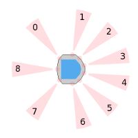
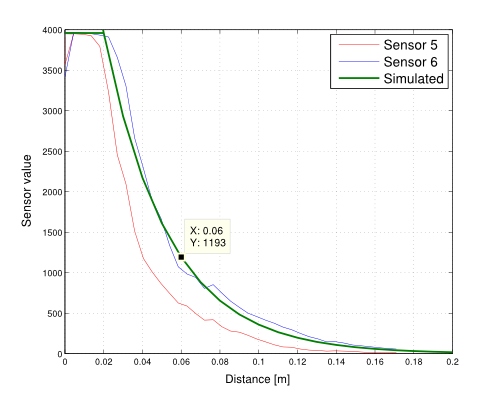

Using PySimiam in Coursera 'Control of mobile robots course'
************************************************************

Introduction
============

This manual is going to be your resource for using the simulator in the programming exercises for this course. 

Installation
------------

Checkout the project source from ``https://github.com/whittenjaw85/pysimiam/tree/weekX`` (where X is the corresponding week for the exercise). Make sure to download a new copy of the simulator *before* you start a new week's programming exercises, or whenever an announcement is made that a new version is available. It is important to stay up-to-date, since new versions may contain important bug fixes or features required for the programming exercises.

Requirements
^^^^^^^^^^^^

You will need a reasonably modern computer to run the robot simulator. While the simulator will run on hardware older than a Pentium 4, it will probably be a very slow experience. You will also need Python 2.7 (http://www.python.org/getit/) and two libraries - Numpy for mathematics (http://www.scipy.org/Download) and PyQT for the GUI (http://www.riverbankcomputing.com/software/pyqt/download).

Bug Reporting
^^^^^^^^^^^^^
If you run into a bug (issue) with the simulator, please leave a message in the discussion forums with a detailed description. The bug will get fixed and a new version of the simulator will be available at github.

Mobile Robot
------------

The mobile robot platform you will be using in the programming exercises is the Khepera III (K3) mobile robot. The K3 is equipped with 11 infrared (IR) range sensors, of which nine are located in a ring around it and two are located on the underside of the robot. The IR sensors are complemented by a set of five ultrasonic sensors. The K3 has a two-wheel differential drive with a wheel encoder for each wheel. It is powered by a single battery on the underside and can be controlled via software on its embedded Linux computer.



.. _coursera-irsensors:

IR Range Sensors
^^^^^^^^^^^^^^^^
For the purpose of the programming exercises in the course, you will have access to the array of nine IR sensors that encompass the K3. IR range sensors are effective in the range 0.02 m to 0.2 m only. However, the IR sensors return raw values in the range of [18, 3960] instead of the measured distances. The figure below demonstrates the function that maps these sensors values to distances.



The green plot represents the sensor model used in the simulator, while the blue and red plots show the sensor response of two different IR sensors (under different ambient lighting levels). The effect of ambient lighting (and other sources of noise) are *not* modelled in the simulator, but will be apparent on the actual hardware.

The function that maps distances, denoted by :math:`\delta`, to sensor values is the following piecewise function:

.. math::
    :nowrap:

    f(\delta) = \left\{\begin{eqnarray}
        3960 & \quad 0m <  \delta  < 0.02m\\ 
        3960e^{-30(\delta-0.02)} & \quad 0.02m <  \delta  < 0.2m
    \end{eqnarray}\right.

For the those curious to explain why IR sensors behave in an exponentially decaying manner: the intensity of the light decays in accordance to the `inverse square law`_. 

.. _inverse square law: http://en.wikipedia.org/wiki/Inverse-square_law

Your supervisor can access the IR array through the ``robot_info`` object that is passed into the ``execute`` function. For example::

    for i, reading in enumerate(robot_info.ir_sensors.readings)
        print 'IR {} has a value of {}'.format(i, reading)

The orientation (relative to the body of the K3, as shown in figure) of IR sensors 1 through 9 is 128°, 75°, 42°, 13°, -13°, -42°, -75°, -128°, and 180°, respectively.

Ultrasonic Range Sensors
^^^^^^^^^^^^^^^^^^^^^^^^
The ultrasonice range sensors have a sensing range of 0.2 m to 4 m, but are not available in the simulator.

.. _coursera-diffdrivedyn:

Differential Wheel Drive
^^^^^^^^^^^^^^^^^^^^^^^^
Since the K3 has a differential wheel drive (i.e., is not a unicyle), it has to be controlled by specifying the angular velocities of the right and left wheel :math:`(v_r,v_l)`, instead of the linear and angular velocities of a unicycle :math:`(v,\omega)`. These velocities are computed by a transformation from :math:`(v,\omega)` to :math:`(v_r,v_\ell)`. Recall that the dynamics of the unicycle are defined as,

.. math::
    \frac{dx}{dt} &= v\cos(\phi) \\
    \frac{dy}{dt} &= v\sin(\phi) \\
    \frac{d\phi}{dt} &= \omega

The dynamics of the differential drive are defined as,

.. math::
    \frac{dx}{dt} &= \frac{R}{2}(v_r + v_l)\cos(\phi) \\
    \frac{dy}{dt} &= \frac{R}{2}(v_r + v_l)\sin(\phi) \\
    \frac{d\phi}{dt} &= \frac{R}{L}(v_r - v_l)

where :math:`R` is the radius of the wheels and :math:`L` is the distance between the wheels.

The speed of the K3 can be set in the following way assuming that you have implemented the ``uni_to_diff`` function, which transforms :math:`(v,\omega)` to :math:`(v_r,v_\ell)`::

    v = 0.15 # m/s
    w = pi/4 # rad/s
    # Transform from v,w to v_r,v_l
    vel_r, vel_l = self.uni2diff(v,w);

Wheel Encoders
^^^^^^^^^^^^^^
Each of the wheels is outfitted with a wheel encoder that increments or decrements a tick counter depending on whether the wheel is moving forward or backwards, respectively. Wheel encoders may be used to infer the relative pose of the robot. This inference is called *odometry*. The relevant information needed for odometry is the radius of the wheel, the distance between the wheels, and the number of ticks per revolution of the wheel. For example::

    R = robot_info.wheels.radius; % radius of the wheel
    L = robot_info.wheels.base_length; % distance between the wheels
    tpr = robot_info.wheels.ticks_per_rev; % ticks per revolution for the wheels

    print 'The right wheel has a tick count of {}'.format(robot_info.wheels.right_ticks)
    print 'The left wheel has a tick count of {}'.format(robot_info.wheels.left_ticks)


Simulator
---------

--- This section has to go to the manual ---

Start the simulator with the ``python qtsimiam.py`` command. It is important that this command is executed inside the downloaded folder (but not inside any of its subdirectories).

Here is a screenshot of the graphical user interface (GUI) of the simulator:

.. image:: simiam.png

The GUI can be controlled by the menu or the toolbar buttons (or their equivalent keyboard shortcuts). The first button is the `Open` button ``Ctrl-O`` and lets you open a world with the robots. The second button is the `Rewind` button and resets the simulation. The third button is the `Play` button, which can be used to play and pause the simulation. The speed of the simulation can be controlled with the slider to the right. The set of `Zoom` buttons allows you to zoom in and out to get a better view of the simulation.

Week 1
======

This week's exercises will help you learn about Python and the robot simulator:

#. Since the programming exercises involve programming in Python, you should familiarize yourself with this language. Point your browser to ``http://docs.python.org/2/tutorial/`` to get an introduction to basic concepts.

#. Familiarize yourself with the simulator by reading the section on the GUI, this manual and running the simulator with different worlds/robots.

Week 2
======

Start by downloading the robot simulator for this week from ``https://github.com/whittenjaw85/pysimiam/tree/week2``. Before you can design and test controllers in the simulator, you will need to implement three components of the Khepera3 supervisor, located in ``pysimiam/supervisors/khepera3.py``.

Transformation from unicycle to differential drive dynamics
--------------------------------------------------------------------

The function used by the supervisor to convert from unicycle dynamics :math:`(v,\omega)` to differential drive dynamics (left and right *angular* wheel speeds :math:`(v_\ell,v_r)`) is named ``uni2diff``::

   def uni2diff(uni):
      (v,w) = uni

      #Insert Week 2 Assignment Code Here

      #End Week 2 Assignment Code

      return (vl, vr)

This function get as its input ``uni``, a python tuple with two values. The function has to return left and right wheel speeds also as a tuple.

You are given the values:

- ``w`` (float) - angular velocity :math:`\omega`
- ``v`` (float) - linear velocity :math:`v`
- ``self.robot.wheels.radius`` (float) - :math:`R`, the radius of robot's wheels
- ``self.robot.wheels.base_length`` (float) - :math:`L`, the distance between wheels

You have to set the values:

- ``vl`` (float) - angular velocity of the left wheel :math:`v_\ell`
- ``vr`` (float) - angular velocity of the right wheel :math:`v_r`

Your job is to assign values to ``vl`` and ``vr`` such that the velocity and omega unicycle input correspond to the robot's left and right wheel velocities. Please refer to section on :ref:`coursera-diffdrivedyn` for the mathematical formulae.

Odometry
--------
 
Implement odometry for the robot, such that as the robot moves around, its pose :math:`(x,y,\theta)` is estimated based on how far each of the wheels have turned. Assume that the robot starts at (0,0,0).
 
The video lectures and, for example the tutorial located at `www.orcboard.org/wiki/images/1/1c/OdometryTutorial.pdf`, cover how odometry is computed. The general idea behind odometry is to use wheel encoders to measure the distance the wheels have turned over a small period of time, and use this information to approximate the change in pose of the robot.

.. note:: the video lecture may refer to robot's orientation as :math:`\phi`.

The pose of the robot is composed of its position :math:`(x,y)` and its orientation :math:`\theta` on a 2 dimensional plane. The currently estimated pose is stored in the variable ``pose_est``, which bundles ``x`` (:math:`x`), ``y`` (:math:`y`), and ``theta`` (:math:`\theta`). The supervisor updates the estimate of its pose by calling the ``estimate_pose`` function. This function is called every ``dt`` seconds, where ``dt`` is 0.02 s (or a little more if the simulation is running slower)::

   def estimate_pose(self):
      
      #Week 2 exercise 
      # Get tick updates
      #self.robot.wheels.left_ticks
      #self.robot.wheels.right_ticks
      
      # Save the wheel encoder ticks for the next estimate
      
      #Get the present pose estimate
      x, y, theta = self.pose_est          
            
      #Use your math to update these variables... 
      theta_new = 0 
      x_new = 0
      y_new = 0
      #end week2 exercise
         
      return Pose(x_new, y_new, (theta_new + pi)%(2*pi)-pi)

You are given these variables:

- ``self.robot.wheels.radius`` (float) - the radius of robot's wheels
- ``self.robot.wheels.base_length`` (float) - the distance between wheels
- ``self.robot.wheels.ticks_per_rev`` (integer) - number of ticks registered per one full wheel revolution
- ``self.robot.wheels.left_ticks`` (integer) - accumulated ticks on the left wheel
- ``self.robot.wheels.right_ticks`` (integer) - accumulated ticks on the right wheel

Note that ``self.robot.wheels.left_ticks`` and ``.right_ticks`` represent
the tick numbering of the encoder and not the elapsed ticks. You will need
to implement a memory variable to store previous values and to calculate
the elapsed ticks. One example of how to do this might be::

   self.prev_right_ticks = self.robot.wheels.right_ticks
   self.prev_left_ticks = self.robot.wheels.left_ticks

Note that ``self.prev_left_ticks`` and ``self.prev_right_ticks`` have to be initialized
in the constructor. The code is already in place for you in the ``__init__()`` method.

Your objective is to solve for the change in `x`, `y`, and `theta`
and from those values update the variables `x_new`, `y_new`, and `theta_new`.
The values `x_new`, `y_new`, and `theta_new` will be used to update
the estimated pose for the supervisor. 

Recall that the equations for odometry are in lecture 2 slides.

Convertion from raw IR values to distances in meters
----------------------------------------------------

The IR sensors return not the distance in meters, but a `reading`. To retrieve the distances measured by the IR proximity sensor, you will need to implement a conversion from the raw IR values to distances in the ``get_ir_distances`` function::

   def get_ir_distances(self):
        """Converts the IR distance readings into a distance in meters"""
        default_value = 3960
        
        #Assignment week2
        ir_distances = [] #populate this list
        #self.robot.ir_sensors.readings (you may want to use this)

        # The following code sets all sensors to out-of-range
        ir_distances = [1]*len(self.robot.ir_sensors.readings)

        #End Assignment week2
        return ir_distances


You are provided with the variable:

- ``self.robot.ir_sensors.readings`` (list of float) - the readings from Khepera3's IR sensors

The section on :ref:`coursera-irsensors` defines a function :math:`f(\delta)` that converts from distances to raw values. Find the inverse, so that raw values in the range [18,3960] are converted to distances in the range [0.02,0.2] m. Then convert the sensor readings to distances and assign them to a list called ir_distances. 
 
Testing
------------------

When you have completed all these exercises, run the simulator with::

> python qtsimiam.py week2.xml

You can change the linear velocity of the robot, or the point to which it steers directly in the GUI by setting the appropriate values in the ``Robot 1: K3DefaultSupervisor`` dock on the right.
In the beginning, your robot will not move, independently on how you set the goal.

After you have implemented the unicycle to differential transformation, first set the goal to (1,0). The robot should drive straight forward. Now, set it to (1,1) or (1,-1). If the `y` coordinate of the goal is positive, the robot should start off by turning to its left, if negative it should start off by turning to its right. If you haven't implemented odometry yet, the robot will just keep on turning in that direction.

With the odometry and the transformation from unicycle to differential drive implemented, set the goal to some value, for example (0.5,0.5), and the robot's go-to-goal controller should steer the robot towards that goal. The supervisor will automatically draw the estimated robot trajectory using ``self.pose_est`` that you have calculated in ``estimate_pose``. You may also want to print ``self.pose_est`` in the beginning of ``estimate_pose`` to better see if it make sense. Remember, the robot starts at :math:`(x,y,\theta)=(0,0,0)`.

When you have implemented the IR raw to distances conversion, set the goal to a value behind the wall, e.g. (2,1). If the conversion works, the robot will not collide with the wall, but will try to avoid it. In the case the conversion doesn't work as expected, try printing the ``ir_distances`` array at the end of the ``get_ir_distances`` function and watch for errors.

Week 3
======

Start by downloading the new robot simulator for this week from GitHub. You are encouraged to reuse your code from week2, but in case you don't want to reuse your code from week2, we placed a default uni2diff and get_ir_distances function within the ``./supervisors/khepera3.py`` module.

This week you will be implementing the different parts of a PID regulator that steers the robot successfully to some goal location. This is known as the go-to-goal behavior. The controller that has to implement this behaviour is located at ``pysimiam/controllers/gotogoal.py``. The important functions to implement are the `clear_error`, `get_heading` and `execute` functions::

   def clear_error(self):
      #Week 3
      #Place any variables you would like to store here
      #You may use these variables for convenience
      self.E = 0 # Integrated error
      self.e_1 = 0 # Previous error calculation

      #End week3

   def get_heading(self,state):
      """Get the vector pointing in the right direction in the form numpy.array([x,y,1]).
      
      The linear velocity of the robot will be scaled by sqrt(x**2 + y**2)
      """
      #Week 3
      # Here is an example of how to get goal position
      # and robot pose data. Feel free to name them differently.

      #x_g, y_g = state.goal.x, state.goal.y
      #x_r, y_r, theta = state.pose

      # Set this variable to the angle to the goal in robot's frame of reference
      self.goal_angle = 0

      return numpy.array([1,0,1])

   def execute(self,state,dt):
      """Executes the controller behavior
      @return --> unicycle model list [velocity, omega]
      """

      heading = self.get_heading(state)

      #Your goal is to modify these two variables
      w = 0
      v = 0 
      #End week3 exercise
      return [v, w] 

In the `clear_error` function, the controller variables are initialized with the default values. It is called once at the creation of the controller. The direction to the goal is calculated in the `get_heading` function, that returns a vector pointing at the goal in the robot's reference frame. This function is called in the `execute` function to steer the robot. The `execute` function is called every time the supervisor uses the go-to-goal behaviour. The following variables are available inside `get_heading` and `execute`:

- ``state.goal.x`` (float) - The X coordinate of the goal
- ``state.goal.y`` (float) - The Y coordinate of the goal
- ``state.pose`` (:class:`~pose.Pose`) - The position and orientation of the robot
- ``state.velocity.v`` (float) - The given target velocity of the robot, which is usually the maximum available.

To extract the pose data, you can use a command like this::

   (x, y, theta) = state.pose

First, calculate the heading unit vector from the robot to the goal. Let :math:`u` be the vector from the robot located at :math:`(x,y)` to the goal located at :math:`(x_g,y_g)` in the world reference frame, then :math:`\theta_g` is the angle :math:`u` makes with the :math:`x`-axis (positive :math:`\theta_g` is in the counterclockwise direction). Use the `x` and `y` components of :math:`u` and the ``math.atan2`` function to compute :math:`\theta_g`.
In the robot frame of reference, the direction of the heading vector can be calculated by subtracting the current heading ``theta`` of the robot. Use this direction to calculate the `x` and `y` components of the unit vector. Set the `z` component to 1.

Second, calculate the error between the obtained and the current heading of the robot. Make sure to keep the error between :math:`[-\pi,\pi]`.
 
Third, calculate the proportional, integral, and derivative terms for the PID regulator that steers the robot to the goal.
 
As before, the robot will drive at a constant linear velocity ``v``, but it is up to the PID regulator to steer the robot to the goal, i.e compute the correct angular velocity ``w``. The PID regulator needs three parts implemented:
 
    #. The first part is the proportional term ``e_P``. It is simply the current error ``e_k``. ``e_P`` is multiplied by the proportional gain ``self.kp`` when computing ``w``.

    #. The second part is the integral term ``e_I``. The integral needs to be approximated in discrete time using the total accumulated error ``self.E_k``, the current error ``e_k``, and the time step ``dt``. ``e_I`` is multiplied by the integral gain ``self.ki`` when computing ``w``, and is also saved as ``self.E_k`` for the next time step.

    #. The third part is the derivative term ``e_D``. The derivative needs to be approximated in discrete time using the current error ``e_k``, the previous error ``self.e_k_1``, and the the time step ``dt``. ``e_D`` is multiplied by the derivative gain ``self.kd`` when computing ``w``, and the current error ``e_k`` is saved as the previous error ``self.e_k_1`` for the next time step.
  

Testing
-------

To test your code, the simulator is set up to use the PID regulator in ``gotogoal.py`` to drive the robot to a goal location and stop. You can change the linear velocity of the robot and the goal location using the dock window on the right.

Make sure the goal is located inside the walls, i.e. the :math:`x` and :math:`y` coordinates of the goal should be in the range :math:`[-1,1]`. Otherwise the robot will crash into a wall on its way to the goal!

#. To test the heading to the goal, check that the green arrow points to the goal. You can also use a ``print`` statement, set the goal location to (1,1) and check that ``theta_g`` is approximately :math:`\frac{\pi}{4} \approx 0.785` initially, and as the robot moves forward (since :math:`v=0.1` and :math:`\omega=0`) ``theta_g`` should increase.

#. To test the error calculation and the PID math, run the simulator and check if the robot drives to the goal location and stops. The trajectory of the robot can be shown using the `View > Show/hide robot trajectories` menu.

Week 4
======

Start by downloading the new robot simulator for this week from GitHub. You should also familiarize youself with the Numpy scientific library, specifically with the ``array`` object and with the ``dot(a,b)`` function implementing the dot product (`http://docs.scipy.org/doc/numpy/`).

This week you will be implementing the different parts of a controller that steers the robot successfully away from obstacles to avoid a collision. This is known as the avoid-obstacles behavior. The IR sensors allow us to measure the distance to obstacles in the environment, but we need to compute the points in the world to which these distances correspond.

.. image:: week-4-ir-points.png

The figure illustrates these points with a black cross. The strategy for obstacle avoidance that we will use is as follows:

#. Transform the IR distances to points in the world.

#. Compute a vector to each point from the robot, :math:`u_1,u_2,\ldots,u_9`.

#. Weigh each vector according to their importance, :math:`\alpha_1u_1,\alpha_2u_2,\ldots,\alpha_9u_9`. For example, the front and side sensors are typically more important for obstacle avoidance while moving forward.

#. Sum the weighted vectors to form a single vector, :math:`u_o=\alpha_1u_1+\ldots+\alpha_9u_9`.

#. Use this vector to compute a heading and steer the robot to this angle.

This strategy will steer the robot in a direction with the most free space (i.e., it is a direction `away` from obstacles). For this strategy to work, you will need to implement two crucial parts of the strategy for the obstacle avoidance behavior in the function ``get_heading`` in ``controllers/avoidobstacles.py`` using the following information:

- ``self.poses`` (list of :class:`~pose.Pose`) - The positions and orientations of IR sensors in the reference frame of the robot
- ``self.kp``, ``self.ki`` and ``self.kd`` - The PID gains of this controller
- ``state.sensor_distances`` (float) - The IR distances measured by each sensor
- ``state.pose`` (:class:`~pose.Pose`) - The position and orientation of the robot
- ``state.velocity.v`` (float) - The given target velocity of the simulation, which is usually the maximum available.

The following code is in place::

    def get_heading(self, state):
        # Calculate vectors:
        self.vectors = numpy.array([[1,0,1]]*len(self.poses))
        
        # Calculate weighted sum:
        heading = numpy.array([1,0,1])
     
        self.away_angle = math.atan2(heading[1],heading[0])
        
        return heading

First, transform the IR distance (which you converted from the raw IR values in Week 2) measured by each sensor to a point in the reference frame of the robot.
  
A point :math:`p_i` that is measured to be :math:`d_i` meters away by sensor :math:`i` can be written as the vector (coordinate) :math:`v_i=\begin{bmatrix}d_i \\ 0\end{bmatrix}` in the reference frame of sensor :math:`i`. We first need to transform this point to be in the reference frame of the robot. To do this transformation, we need to use the pose (location and orientation) of the sensor in the reference frame of the robot: :math:`(x_{s_i},y_{s_i},\theta_{s_i})`. The transformation is defined as:

.. math::
    v'_i = R(x_{s_i},y_{s_i},\theta_{s_i})\begin{bmatrix}v_i \\ 1\end{bmatrix}

where :math:`R` is known as the transformation matrix that applies a translation by :math:`(x,y)` and a rotation by :math:`\theta`:

.. math::
    R(x,y,\theta) = \begin{bmatrix}
        \cos(\theta) & -\sin(\theta) & x \\ 
        \sin(\theta) &  \cos(\theta) & y \\
                    0 &             0 & 1
        \end{bmatrix}.

This matrix for a particular sensor can be obtained by calling the method ``get_transformation`` on the sensor's pose. To construct the coordinates of
the point in the sensor reference frame, use the ``numpy.array`` constructor.
Store the result of the transformation in the variable ``self.vectors``.
      
The :math:`v'` matrix now contains the coordinates of the points illustrated in the simulator by the black crosses. Note how these points `approximately` correspond to the distances measured by each sensor.

.. note:: The points do not exactly correspon to the distances because of how we converted from raw IR values to meters in Week 2).
  
Secont, use the set of transformed points to compute a vector that points away from the obstacle. The robot will steer in the direction of this vector and successfully avoid the obstacle.
  
#. Compute a vector :math:`u_i` to each point (corresponding to a particular sensor) from the robot. Use a point's coordinate from ``ir_distances_rf`` and the robot's location ( ``x``, ``y`` ) for this computation.

#. Pick a weight :math:`\alpha_i` for each vector according to how important you think a particular sensor is for obstacle avoidance. For example, if you were to multiply the vector from the robot to point :math:`i` (corresponding to sensor :math:`i`) by a small value (e.g., :math:`0.1`), then sensor :math:`i` will not impact obstacle avoidance significantly. Set the weights in ``sensor_gains``.

    .. note:: Make sure to that the weights are symmetric with respect to the left and right sides of the robot. Without any obstacles around, the robot should not steer left or right.

#. Sum up the weighted vectors, :math:`\alpha_iu_i`, into a single vector :math:`u_o`.

#. Use :math:`u_o` and the pose of the robot to compute a heading that steers the robot away from obstacles (i.e., in a direction with free space, because the vectors that correspond to directions with large IR distances will contribute the most to :math:`u_o`).

#. Use your code from the go-to-goal controller to calculate the necessary velocities    in the unicycle model.
   
Testing
-------

To test your code, the simulator is set up to use load the ``AvoidObstacles.m`` controller to drive the robot around the environment without colliding with any of the walls.
Here are some tips on how to test the three parts:

#. Once you have implemented the calculation of obstacle vectors, a black cross should match up with each sensor as shown in figure. The robot should drive forward and collide with the wall.

#. Once you have implemented the steering, the robot should be able to successfully navigate the world without colliding with the walls (obstacles). If no obstacles are in range of the sensors, the red arrow (representing :math:`u_o`) should just point forward (i.e., in the direction the robot is driving). In the presence of obstacles, the red line should point away from the obstacles in the direction of free space.

You can also tune the parameters of the PID regulator for :math:`\omega`.

.. note:: The red and green arrows (as well as, the black crosses) will likely deviate from their positions on the robot. The reason is that they are drawn with information derived from the odometry of the robot. The odometry of the robot accumulates error over time as the robot drives around the world. This odometric drift can be seen when information based on odometry is visualized via the lines and crosses. 

How to migrate your solutions from last week
--------------------------------------------

Here are a few pointers to help you migrate your own solutions from last week to this week's simulator code. You only need to pay attention to this section if you want to use your own solutions, otherwise you can use what is provided for this week and skip this section.

The ``gotogoal.py`` controller has been split into two parts - the PID and the go-to-goal heading. You may replace the PID code in ``pysimiam/controllers/pid_controller.py`` and the heading code in ``pysimiam/controllers/gotogoal.py`` with your code from last week.

Week 5
======

Start by downloading the new robot simulator for this week from GitHub. This week you will be making a small improvement to the go-to-goal and avoid-obstacle controllers and testing two arbitration mechanisms: blending and hard switches. Arbitration between the two controllers will allow the robot to drive to a goal, while not colliding with any obstacles on the way.

Linear velocity dependent on angular velocity
---------------------------------------------

So far, we have implemented controllers that either steer the robot towards a goal location, or steer the robot away from an obstacle. In both cases, we have set the linear velocity, :math:`v`, to a constant value defined in the simulator. While this approach works, it certainly leave plenty of room for improvement. We will improve the performance of both the go-to-goal and avoid-obstacles behavior by dynamically adjusting the linear velocity based on the angular velocity of the robot.

The actuator limits of the robot limit the left and right wheel velocities to a range of :math:`[-2.587, 2.587]` rad/s. Thus, it is important to remember that with a differential drive, we cannot, for example, drive the robot at the maximum linear and angular velocities. There is a trade-off between linear and angular velocities: linear velocity has to decrease for angular velocity to increase, and vice versa.

Therefore, design and implement a function or equation for the linear velocity that depends on the angular velocity, such that the linear velocity is large when the `absolute value` of the angular velocity is small (near zero), and the linear velocity is small when the absolute value of the angular velocity is large. Remember that we want to maintain a minimum linear velocity to keep the robot moving. Add it to to the general PID controller in ``pysimiam/controllers/pid_controller.py``.

.. note:: This is just one way to improve the controllers. For example, one could improve the above strategy by letting the linear velocity be a function of the angular velocity `and` the distance to the goal (or distance to the nearest obstacle). If you want to go in this direction, consider using the length of the heading vector returned from ``get_heading`` to scale the linear velocity.

Blending
--------

It's time to implement the first type of arbitration mechanism between multiple controllers: `blending`. The solutions to the go-to-goal and avoid-obstacles controllers have been combined into a single controller ``pysimiam/controller/blending.py``. However, one important piece (namely the implementation of ``get_heading``) is missing::

    def get_heading(self, state):
        u_ao = self.get_ao_heading(state)
        u_gtg = self.get_gtg_heading(state)
        
        u = numpy.array([1,0,1])
        
        self.blend_angle = math.atan2(u[1],u[0])
        
        return u

Here, ``u_gtg`` is a vector pointing to the goal from the robot, and ``u_ao`` is a vector pointing from the robot to a point in space away from obstacles. These two vectors need to be combined (blended) in some way into the vector ``u``, which should be a vector that points the robot both away from obstacles and towards the goal.

The combination of the two vectors into ``u`` should result in the robot driving to a goal without colliding with any obstacles in the way. Do not use ``if/else`` to pick between ``u_gtg`` or ``u_ao``, but rather think about weighing each vector according to their importance, and then linearly combining the two vectors into a single vector, ``u_ao_gtg``. For example,

.. math::
    \alpha &=& 0.75 \\
    u &=& \alpha u_{\mathrm{gtg}}+(1-\alpha)u_{\mathrm{ao}}

In this example, the go-to-goal behavior is stronger than the avoid-obstacle behavior, but that `may` not be the best strategy. :math:`\alpha` needs to be carefully tuned (or a different weighted linear combination needs to be designed) to get the best balance between go-to-goal and avoid-obstacles.

Switching
---------

The second type of arbitration mechanism is `switching`. Instead of executing both go-to-goal and avoid-obstacles simultaneously, we will only execute one controller at a time, but switch between the two controllers whenever a certain condition is satisfied.
    
You will need to implement the switching logic between go-to-goal and avoid-obstacles in ``pysimiam/supervisors/k3switchingsupervisor.py``. The supervisor has been extended since last week to support switching between different controllers (or states, where a state simply corresponds to one of the controllers being executed). In order to switch between different controllers (or states), the supervisor has to define the switching conditions. These conditions are checked to see if they are true or false. The idea is to start of in some state (which runs a certain controller), check if a particular condition is fullfilled, and if so, switch to a new controller.

The switching itself is already implemented for you in the base :class:`~supervisor.Supervisor` class. To add a state with a controller ``c0``, use the ``add_controller`` method of the supervisor::
    
    self.add_controller(c0, (condition1, c1), (condition2, c2), ...)

where the conditions are functions that take no parameters and evaluate to true or false. If a condition evaluates to true, the controller is switched e.g. to ``c1`` for ``condition1``.

We suggest definin at least the following conditions:

* ``at_obstacle`` checks to see if any of front sensors (all but the three IR sensors in the back of the robot) detect an obstacle at a distance less than a certain limiting distance. Return ``true`` if this is the case, ``false`` otherwise.
* ``at_goal`` checks to see if the robot is within ``self.d_stop`` meters of the goal location.
* ```obstacle_cleared'`` checks to see if all of the front sensors report distances greater than some fixed distance. Remember, that this distance has to be larger than the distance used by ``at_obstacle``, to avoid Zeno behaviour.

Implement the logic for switching to ``avoid_obstacles``, when ``at_obstacle`` is true, switching to ``go_to_goal`` when ``obstacle_cleared`` is true, and switching to ``hold`` when ``at_goal`` is true. 
  
Mix blending and switching
--------------------------

The blending controller's advantage is that it (hopefully) smoothly blends go-to-goal and avoid-obstacles together. However, when there are no obstacle around, it is better to purely use go-to-goal, and when the robot gets dangerously close, it is better to only use avoid-obstacles. The switching logic performs better in those kinds of situations, but jitters between go-to-goal and avoid-obstacle when close to a goal. A solution is to squeeze the blending controller in between the go-to-goal and avoid-obstacle controller.

Implement additional conditions in ``pysimiam/supervisors/k3switchingsupervisor.py``:

* ``unsafe``, that checks to see if any of the front sensors detect an obstacle closer than a critical distance (this distance should be smaller than ``at_obstacle`` critical distance).
* ``safe``, that checks if the the minimal distance is larger than the critical distance.

Those conditions can now be used to implement switching like shown on the diagram:

.. image:: blending_states.png

How to test it all
------------------

The code for this week is implemented in two different supervisors, ``K3SwitchingSupervisor`` and ``K3BlendingSupervisor``. You can test the two separately or make them race against one another. To test the two separately, load the worlds ``week5_switching.xml`` or ``week5_blending.xml``. The race world is ``week5_race.xml``.

Here are some tips to the test the four parts:

#. Test the second part by running ``python qtsimiam_week5_blending.py``. The robot should successfully navigate to the goal location (1,1) without colliding with the obstacle that is in the way. Once the robot is near the goal, it should stop. The output plot will likely look something similar to:

   .. image:: week-5-part-2.png

#. Test the third part by setting ``python qtsimiam_week5_switching.py``. The robot should successfully navigate to the same goal location (1,1) without colliding with the obstacle that is in the way. Once the robot is near the goal, it should stop. The output plot will likely look something similar to:

   .. image:: week-5-part-3.png
    
   Notice that the blue line is the current heading of the robot, the red line is the heading set by the go-to-goal controller, and the green line is the heading set by the avoid-obstacles controller. You should see that the two switch very quickly and often when next to the goal. Also, you will see many messages in the MATLAB window stating that a switch has occurred.
  
#. Test the fourth part in the same way as the third part. This time, the output plot will likely look something similar to:

   .. figure:: week-5-part-4.png
    
   Notice that the controller still switches, but less often than before. Also, it now switches to the blended controller (cyan line). Depending on how you set the critical distances, the number of switches and between which controllers the supervisor switches may change. Experiment with different settings to observe their effect.


How to migrate your solutions from last week
--------------------------------------------

You can replace all of the provided go-to-goal and avoid-obstacles code with your code from the last week.

Week 6
======

Start by downloading the new robot simulator for this week from the `Programming Exercises` tab on the Coursera course page. This week you will be implementing a wall following behavior that will aid the robot in navigating around obstacles. Implement these parts in ``+simiam/+controller/+FollowWall.m``.

#. Compute a vector, :math:`u_{fw,t}`, that estimates a section of the obstacle (`wall`) next to the robot using the robot's right (or left) IR sensors.
   
   We will use the IR sensors to detect an obstacle and construct a vector that approximates a section of the obstacle (`wall`). In the figure, this vector, :math:`u_{fw,t}` (``u_fw_t``), is illustrated in red.
   
   .. image:: week-6-part-1.png
   
   The direction of the wall following behavior (whether it is follow obstacle on the left or right) is determined by ``inputs.direction``, which can either be equal to ``right`` or ``left``. Suppose we want to follow an obstacle to the ``left`` of the robot, then we would could use the left set of IR sensors (1-4). If we are following the wall, then at all times there should be at least one sensor that can detect the obstacle. So, we need to pick a second sensor and use the points corresponding to the measurements from these two sensors (see avoid-obstacles in Week 4) to form a line that estimates a section of the obstacle. In the figure above, sensors 2 and 3 are used to roughly approximate the edge of the obstacle. But what about corners?
    
   .. image:: week-6-part-1b.png
   
   Corners are trickier (see figure below), because typically only a single sensor will be able to detect the wall. The estimate is off as one can see in the figure, but as long as the robot isn't following the wall too closely, it will be ok.
   
   An example strategy for estimating a section of the wall is to pick the two sensors (from IR sensors 1-4) with the smallest reported measurement in ``ir_distances``. Suppose sensor 2 and 3 returned the smallest values, then let :math:`p_1` ``= ir_distances_rf(:,2)`` and :math:`p_2` ``= ir_distances_rf(:,3)``. A vector that estimates a section of the obstacle is :math:`u_{fw,t}=p_2-p_1`. 
   
   .. note:: It is important that the sensor with smaller ID (in the example, sensor 2) is assigned to :math:`p_1` (``p_1``) and the sensor with the larger ID (in the example, sensor 3) is assigned to :math:`p_2` (``p_2``), because we want that the vector points in the direction that robot should travel.
   
   The figures correspond to the above example strategy, but you may want to experiment with different strategies for computing :math:`u_{fw,t}`. A better estimate would make wall following safer and smoother when the robot navigates around the corners of obstacles. 
   
#. Compute a vector, :math:`u_{fw,p}`, that points from the robot to the closest point on :math:`u_{fw,t}`.
   
   Now that we have the vector :math:`u_{fw,t}` (represented by the red line in the figures), we need to compute a vector :math:`u_{fw,p}` that points from the robot to the closest point on :math:`u_{fw,t}`. This vector is visualized as blue line in the figures and can be computed using a little bit of linear algebra:

   .. math::
      \begin{split}
         u'_{fw,t} &= \frac{u_{fw,t}}{\|u_{fw,t}\|}, \quad u_p = \begin{bmatrix} x \\ y \end{bmatrix}, \quad u_a = p_1 \\
         u_{fw,p} &= (u_a-u_p)-((u_a-u_p)\cdot u'_{fw,t})u'_{fw,t}
      \end{split}
   
   :math:`u_{fw,p}` corresponds to ``u_fw_p`` and :math:`u'_{fw,t}` corresponds to ``u_fw_tp`` in the code. 
   
   .. note:: A small technicality is that we are computing :math:`u_{fw,p}` as the the vector pointing from the robot to the closest point on :math:`u_{fw,t}`, as if :math:`u_{fw,t}` were infinitely long.
   
#. Combine the two vectors, such that it can be used as a heading vector for a PID controller that will follow the wall to the right (or left) at some distance :math:`d_{fw}`.
   
   The last step is to combine :math:`u_{fw,t}` and :math:`u_{fw,p}` such that the robot follows the obstacle all the way around at some distance :math:`d_{fw}` (``d_fw``). :math:`u_{fw,t}` will ensure that the robot drives in a direction that is parallel to an edge on the obstacle, while :math:`u_{fw,p}` needs to be used to maintain a distance :math:`d_{fw}` from the obstacle.
    
   One way to achieve this is,

   .. math::
      u'_{fw,p} = u_{fw,p}-d_{fw}\frac{u_{fw,p}}{\|u_{fw,p}|},
   
   where :math:`u'_{fw,p}` (``u_fw_pp``) is now a vector points towards the obstacle when the distance to the obstacle, :math:`d>d_{fw}`, is near zero when the robot is :math:`d_{fw}` away from the obstacle, and points away from the obstacle when :math:`d<d_{fw}`.
   
   All that is left is to linearly combine :math:`u'_{fw,t}` and :math:`u'_{fw,p}` into a single vector :math:`u_{fw}` (``u_fw``) that can be used with the PID controller to steer the robot along the obstacle at the distance :math:`d_{fw}`.
   
   (`Hint`: Think about how this worked with :math:`u_{ao}` and :math:`u_{gtg}` last week). 

How to test it all
------------------

To test your code, the simulator is set up to run ``+simiam/+controller/FollowWall.m``. First test the follow wall behaviour by setting ``inputs.direction = `left'`` in ``+simiam/+controller/+khepera3/`` ``K3Supervisor.m``. This will test the robot following the obstacle to its left (like in the figures). Then set ``inputs.direction = `right'``, and changed in ``settings.xml`` the initial theta of the robot to :math:`\pi`:

.. code-block:: xml

     <pose x="0" y="0" theta="3.1416" />

The robot is set up near the obstacle, so that it can start following it immediately. This is a valid situation, because we are assuming another behavior (like go-to-goal) has brought us near the obstacle. Here are some tips to the test the three parts:


    #. Set ``u_fw = u_fw_tp``. The robot starts off next to an obstacle and you should see that the red line approximately matches up with the edge of the obstacle (like in the figures above). The robot should be able to follow the obstacle all the way around.
    
    .. note:: Depending on how the edges of the obstacle are approximated, it is possible for the robot to peel off at one of the corners. This is not the case in the example strategy provided for the first part.
    
    #. If this part is implemented correctly, the blue line should point from the robot to the closest point on the red line.
    
    .. image:: week-6-part-2.png
    
    .. note:: Recall that we are computing :math:`u_{fw,p}` (the blue line) as the the vector pointing from the robot to the closest point on :math:`u_{fw,t}`, as if :math:`u_{fw,t}` (the red line) were infinitely long. In the figure above, the red line is not drawn infinitely long, so the blue line does not touch the red line in this situation. However, if we were to extend the red line, we would see that the blue line correctly points to the closest point on the red line to the robot.
    
    #. Set ``self.d_fw`` to some distance in :math:`[0.02,0.2]` m. The robot should follow the wall at approximately the distance specified by ``self.d_fw``. If the robot does not follow the wall at the specified distance, then :math:`u'_{fw,p}` is not given enough weight (or :math:`u'_{fw,t}` is given too much weight).
    


How to migrate your solutions from last week
--------------------------------------------

Here are a few pointers to help you migrate your own solutions from last week to this week's simulator code. You only need to pay attention to this section if you want to use your own solutions, otherwise you can use what is provided for this week and skip this section.

 #. The only new addition to the simulator is ``+simiam/+controller/FollowWall.m``. Everything else may be overwrite with the exception of ``K3Supervisor.m``.


Week 7
======
Start by downloading the new robot simulator for this week from the `Programming Exercises` tab on the Coursera course page. This week you will be combining the go-to-goal, avoid-obstacles, and follow-wall controllers into a full navigation system for the robot. The robot will be able to navigate around a cluttered, complex environment without colliding with any obstacles and reaching the goal location successfully. Implement your solution in ``+simiam/+controller/+khepera3/K3Supervisor.m``.


#. Implement the ``progress_made`` event that will determine whether the robot is making any progress towards the goal.
  
   By default, the robot is set up to switch between ``avoid_obstacles`` and ``go_to_goal`` to navigate the environment. However, if you launch the simulator with this default behavior, you will notice that the robot cannot escape the larger obstacle as it tries to reach the goal located at :math:`(x,g)=(1,1)`. The robot needs a better strategy for navigation. This strategy needs to realize that the robot is not making any forward progress and switch to ``follow_wall`` to navigate out of the obstacle.
    
   Implement the function ``progress_made`` such that it returns ``true`` if

   .. math::
      \left\|\begin{bmatrix} x-x_g \\ y-y_g \end{bmatrix}\right\| < d_{\text{progress}}-\epsilon,
   
   where :math:`\epsilon=0.1` (``epsilon``) gives a little bit of slack, and :math:`d_{\text{progress}}` (``d_prog``) is the closest (in terms of distance) the robot has progressed towards the goal. This distance should be set using the function ``set_progress_point`` before switching to the ``follow_wall`` behavior in the third part.

#. Implement the ``sliding_left`` and ``sliding_right`` events that will serve as a criterion for whether the robot should continue to follow the wall (left or right) or switch back to the go-to-goal behavior.

   While the lack of ``progress_made`` will trigger the navigation system into a ``follow_wall`` behavior, we need to check whether the robot should stay in the wall following behavior, or switch back to ``go_to_goal``. We can check whether we need to be in the sliding mode (wall following) by testing if :math:`\sigma_1>0` and :math:`\sigma_2>0`, where

   .. math::
      \begin{bmatrix}u_{gtg} & u_{ao}\end{bmatrix}\begin{bmatrix}\sigma_1 \\ \sigma_2\end{bmatrix} = u_{fw}.
   
   
   Implement this test in the function ``sliding_left`` and ``sliding_right``. The test will be the same for both functions. The difference is in how :math:`u_{fw}` is computed.

#. Implement the finite state machine that will navigate the robot to the goal located at :math:`(x_g,y_g)=(1,1)` without colliding with any of the obstacles in the environment.
   
   Now, we are ready to implement a finite state machine (FSM) that solves the full navigation problem. A finite state machine is nothing but a set of ``if/elseif/else`` statements that first check which state (or behavior) the robot is in, then based on whether an event (condition) is satisfied, the FSM switches to another state or stays in the same state. Some of the logic that should be part of the FSM is:
   
      #. If ``at_goal``, then switch to ``stop``.
      #. If ``unsafe``, then switch to state ``avoid_obstacles``.
      #. If in state ``go_to_goal`` and ``at_obstacle``, then check whether the robot needs to ``slide_left`` or ``slide_right``. If so ``set_progress_point``, and switch to state ``follow_wall`` (with ``inputs.direction`` equal to right or left depending on the results of the sliding test).
      #. If in state ``follow_wall``, check whether ``progress_made`` and the robot does not need to slide ``slide_left`` (or ``slide_right`` depending on ``inputs.direction``). If so, switch to state ``go_to_goal``, otherwise keep following wall.
   
   
   You can check an event using ``self.check_event(`name-of-event')`` and switch to a different state using ``self.switch_to_state(`name-of-state')``.


How to test it all
------------------

To test your code, the simulator is set up to run a simple FSM that is unable to exit the large obstacle and advance towards the goal.


  #. Test the first part with the third part.
  #. Test the second part with the third part.
  #. Testing the full navigation systems is mostly a binary test: does the robot successfully reach the goal located at :math:`(x_g,y_g)=(1,1)` or not? However, let us consider a few key situations that will likely be problematic.
  
    #. First, the default code has the problem that the robot is stuck inside the large obstacle. The reason for this situation is that avoid obstacle is not enough to push the robot far enough way from the obstacle, such that when go-to-goal kicks back in, the robot is clear of the obstacle and has a free path towards the goal. So, you need to make sure that the robot realizes that no progress towards the goal is being made and that wall following needs to be activated for the robot to navigate out of the interior of the large obstacle.
    #. Second, assuming that the robot has escaped the interior of the large obstacle and is in wall following mode, there is a point at which progress is again being made towards the goal and sliding is no longer necessary. The robot should then stop wall following and resume its go-to-goal behavior. A common problem is that the robot either continues to follow the edge of the large obstacle and never makes the switch to go-to-goal. Another common problem is that the FSM switches to the go-to-goal behavior before the robot has the chance to escape the interior of the large obstacle using wall following. Troubleshoot either problem by revisiting the logic that uses the ``progress_made`` and ``sliding_left`` (``sliding_right``) events to transition from ``follow_wall`` to ``go_to_goal``.
  
  Remember that adding ``print`` calls to different parts of your code can help you debug your problems. By default, the supervisor prints out the state that it switches to.


How to migrate your solutions from last week
--------------------------------------------

Here are a few pointers to help you migrate your own solutions from last week to this week's simulator code. You only need to pay attention to this section if you want to use your own solutions, otherwise you can use what is provided for this week and skip this section.


 #. Everything may be overwrite with the exception of ``K3Supervisor.m``.
