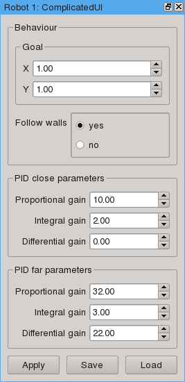

.. _supervisor-tutorial:

Writing a supervisor
====================

A supervisor controls a robot. That means, that for a particular kind of robot,
the supervisor can deduce the state of the robot (such as its pose) from the
provided information (such as the reading of its wheel encoders), and set the
inputs (such as wheel speeds) to make the robot attain a particular goal.

In order to achieve this, the supervisor should subdivide achieving the goal
into several small tasks and use one or more :ref:`controllers<controller-tutorial>` to accomplish them.
The controllers are supposed to be general, reusable robot behaviors, and the
task of the supervisor is to choose a suitable controller and supply the expected
parameters to it, as deduced from the particular robot's parameters.

The simple case
---------------

The simplest supervisor only has one behavior for the robot. In the constructor,
the supervisor should create the corresponding controller and assign it to the
:attr:`~supervisor.Supervisor.current` variable. In order to load the controller,
it is recommended to use the :meth:`~supervisor.Supervisor.create_controller` method,
that accepts a controller :ref:`module string<module-string>` and the initial
parameters for the controller.

The simulator will call the :meth:`~supervisor.Supervisor.execute` method and
supply the state of the robot, as returned by :meth:`~robot.Robot.robot_info`,
and the elapsed time. By default, the supervisor will use the
:meth:`~supervisor.Supervisor.process_state_info` method to interpret the
information about the robot and then use the structure returned by
:meth:`~supervisor.Supervisor.get_controller_state` to execute
the controller. The return value of the controller is passed to the simulator
and subsequently to the robot's inputs. As the controller output may not be
in the right format for the robot, you can overwrite the :meth:`~supervisor.Supervisor.execute`
method and transform the output before returning it to the simulator
(see :meth:`supervisors.khepera3.K3Supervisor.execute` for an example)

Using the state machine
-----------------------

In a more complicated supervisor, there will be more than one controller, and
thus more than one state. The base supervisor class implements a finite state
machine to handle this. This state machine then switches between
states (controllers) as the state of the robot and its environment changes.

The state machine is defined as a set of controllers (states) and conditions, that would
lead to a change of the current controller. To fully define one state,
the :meth:`~supervisor.Supervisor.add_controller` method of the supervisor should
be called in the following way::
    
    self.add_controller(c0, (condition1, c1), (condition2, c2), ...)

to add a state with a controller ``c0``. The conditions are functions that take
no parameters and evaluate to true or false. If a condition evaluates to true,
the controller is switched e.g. to ``c1`` for ``condition1``.

.. note:: Since the condition functions are called without any arguments, all
 of the parameters you want to access in them, should be stored in the supervisor.
 A good place to do that is the :meth:`~supervisor.Supervisor.process_state_info` method,
 that is guaranteed to be called before any conditions are checked. In very
 complicated cases, that might not be covered by this state machine, you are welcome
 to overwrite the :meth:`~supervisor.Supervisor.execute` method and implement
 a more fine-grained behavior.

Run-time access to parameters
-----------------------------

It is possible to let the user change some of the supervisor's parameters when
the simulation is running. The user can access the parameters by using the docking
windows in the interface. Each window corresponds to one supervisor, and
the content of the window is controlled completely by that supervisor.

To define the interface, you will have to implement the :meth:`~supervisor.Supervisor.get_ui_description` method.
The return value is a dictionary, where every key corresponds to a value label
or a value group label, and the values are either further dictionaries, or numbers,
or strings. Let's have a look at the following example:
    

   
This dock was generated with the following code::
    
    def get_ui_description(self,p = None):
        """Returns the UI description for the docker"""
        if p is None:
            p = self.parameters
        
        return [('behavior',[
                    ('goal', [
                        ('x',p.behavior.goal.x),
                        ('y',p.behavior.goal.y)]),
                    (('follow', 'Follow walls'), (p.behavior.follow,['yes','no'])),
                    ]),
                (('pid','PID close parameters','close'),[
                    (('kp','Proportional gain'), p.pid['close'].kp),
                    (('ki','Integral gain'), p.pid['close'].ki),
                    (('kd','Differential gain'), p.pid['close'].kd)
                    ]),
                (('pid','PID far parameters','far'), [
                    (('kp','Proportional gain'), p.pid['far'].kp),
                    (('ki','Integral gain'), p.pid['far'].ki),
                    (('kd','Differential gain'), p.pid['far'].kd)
                    ])
                ]
    
As you see, every (key, value) tuple in the list that is returned from ``get_ui_description``
corresponds to an interface element. The type of the element depends on the type of `value`.
``('x',3.0)`` will create a spin-box, ``('color',('yellow',['red','yellow','green']))`` - a set
of radio-buttons `red`, `yellow` and `green` with `yellow` selected, and
``('goal', [ ('x',1.0), ('y', 1.0)] )`` a grouping box with two spin-boxes inside.

The key may be a string or a tuple with two or three values. The string or the
first field of the tuple is the name of the field in the structure, like ``p.behavior``
above. It is also the name of an XML tag that corresponds to this element if
the parameters are saved to a file. If the tuple has a second field, it is used
as a label. In the case no label is supplied, the field name is capitalized and used
as a label. A third field in the tuple is useful in the case you have two or more identical
structures in your parameters. It is translated to the `id` attribute of the XML
tag and to the key of the dictionary, that becomes a field of the parameters
structure.

In the example above, the `p` argument of ``get_ui_description`` has a structure
identical to the one that will be supplied to :meth:`~supervisor.Supervisor.set_parameters`
method if the user clicks `Apply` in the dock. Although this is not required, it can considerably
simplify :meth:`~supervisor.Supervisor.get_parameters`, from which such a structure has to be returned.

.. note:: The implementation of the Khepera3 supervisors use the same structure
 ``self.parameters`` to both store the parameters and to pass parameters to controllers.
 This behavior is neither compulsory nor ideal. In the general case, the controllers
 might require differently structured information.

Drawing additional stuff
------------------------

The supervisor can also convey some information to the user by drawing on the view.
This can be used e.g. to debug the controllers and the supervisor itself.
The drawing happens in the :meth:`~supervisor.Supervisor.draw` function, that
takes a single :class:`~renderer.Renderer` parameter. Drawing happens after the
:meth:`~supervisor.Supervisor.execute` has been called, and so the supervisor
can draw content directly related to the current state of the world.

API
---

.. automodule:: supervisor
    :noindex:
    :members:

