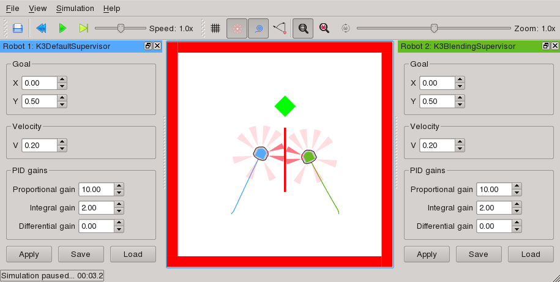
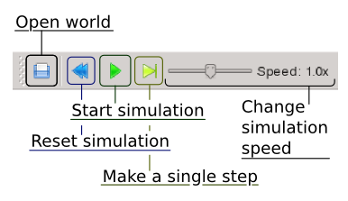
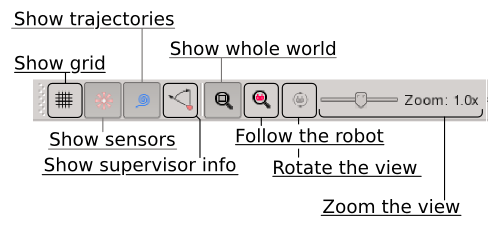

Tutorial
========

Installing pySimiam
-------------------

External dependencies
^^^^^^^^^^^^^^^^^^^^^

First, make sure you have the following available on your system:

PyQT ---> http://www.riverbankcomputing.com/software/pyqt/download

Numpy ---> http://www.scipy.org/Download

Python 2.7 [#python3]_ ---> http://www.python.org/getit/

Downloading pySimiam
^^^^^^^^^^^^^^^^^^^^

The lastest release of pySimiam is available from `Sourceforge <http://sourceforge.net/projects/pysimiam/files/releases/>`_

Unzip the latest provided archive and you are good to go!

.. _gui-tutorial:

Running pySimiam
----------------

To start the simulator, run the following from the command-line in the ``pysimiam`` folder::
    
    >>> python qtsimiam.py playground.xml
    
This will load a 'world' with two robots into the simulator. By default the simulation is stopped. Push the green 'play' button to start it.
Here is a screenshot of the Qt graphical user interface (GUI) of the simulator:

The GUI can be controlled by the menu or the toolbar buttons
(or their equivalent keyboard shortcuts). The first toolbar controls the execution:
    

Every time the simulation is restarted, the robot, supervisor and controller code
is reloaded. Therefore, it is possible to change the code without restarting the simulator - 
restarting the simulation is enough.

.. note:: There is a known bug with code reloading malfunctioning. In the case you
 are constantly getting weird error messages, restart the simulator, and they should
 go away.

The second toolbar controls the display options:
    

The docking windows on the left and on the right display the parameters of the
robots' supervisors. These parameters can be changed at runtime by clicking `Apply`.
It is up to the supervisor to implement those runtime changes.
You can also save and load important parameter sets by using `Save` and `Load` buttons.

.. rubric:: Footnotes

.. [#python3] Python 3 is not officially supported, but the simulator should run with it as well. It you are using or have tried to use Python 3 and have encountered problems, please tell us.
